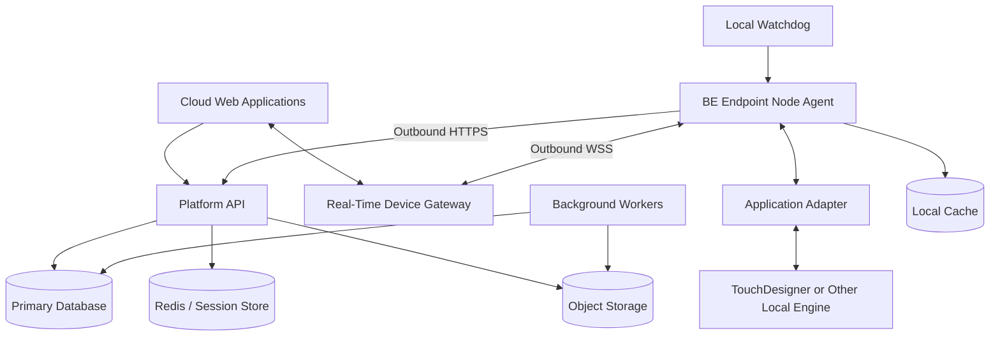

# System Architecture

## High-level architecture



## Cloud components

### Platform API

Provides:

- User authentication
- Company and tenancy management
- Device claiming and assignment
- Room and site management
- Configuration management
- Preset management
- Software release management
- Audit log queries
- Webhook configuration

### Real-Time Device Gateway

Provides:

- Persistent endpoint connections
- Persistent browser connections
- Command routing
- State distribution
- Online/offline presence
- Acknowledgements
- Session membership
- Rate limiting

The gateway should not contain business logic that belongs in the Platform API.

### Background workers

Handle:

- Software deployment jobs
- Configuration deployment
- Webhook delivery
- Telemetry aggregation
- Offline-device alerts
- Certificate rotation
- Expired pairing cleanup
- Retrying failed non-live operations

### Database

Stores durable platform state:

- Companies
- Users
- Devices
- Rooms
- Assignments
- Configurations
- Presets
- Desired state
- Reported state snapshots
- Releases
- Audit events
- Webhooks

### Redis or equivalent

Stores temporary state:

- Pairing codes
- Device presence
- Browser sessions
- Command correlation
- Short-lived locks
- Rate-limit counters

### Object storage

Stores:

- Agent installers
- Adapter packages
- TouchDesigner projects
- Media assets
- Configuration bundles
- Log archives
- Update manifests

## Endpoint components

### Windows service

A small Windows service should own:

- Device identity
- Cloud connectivity
- Local database
- Process supervision
- Updates
- Telemetry
- Adapter lifecycle

### Optional tray or commissioning application

A separate local UI can provide:

- Current device identity
- Network state
- Pairing code
- Cloud connection state
- Assigned company and room
- Diagnostic export
- Restart agent
- Open local logs

This UI should communicate with the Windows service over local IPC.

### Adapter host

The agent should load adapters through a stable internal contract.

The first implementation can keep adapters in-process for simplicity. A later implementation may run higher-risk adapters in separate processes.

### Local data store

Use SQLite or an equivalent embedded database for:

- Device configuration
- Last known cloud configuration
- Pending telemetry
- Pending audit events
- Installed release metadata
- Update history
- Command deduplication
- Cached permissions
- Adapter state

### Watchdog

The watchdog should be independent from the main agent process where practical.

It checks:

- Agent process health
- TouchDesigner process health
- Connection freshness
- Disk capacity
- Repeated crash loops

## Network rules

The endpoint should normally require only outbound access:

```text
TCP 443 HTTPS
TCP 443 Secure WebSocket
DNS
Time synchronisation
Optional package/content CDN access
```

The design should not require:

- Inbound port forwarding
- Public endpoint IP addresses
- Direct access to TouchDesigner
- Direct cloud access to localhost services
- Permanent local-network discovery

## Multi-product model

A single device can expose one or more adapters:

```json
{
  "deviceId": "dev_01K...",
  "adapters": [
    {
      "adapterType": "touchdesigner",
      "adapterVersion": "1.0.0"
    },
    {
      "adapterType": "system-health",
      "adapterVersion": "1.0.0"
    }
  ]
}
```

The cloud should address product capabilities, not implementation paths.

## Deployment model

For the first release, a modular monolith in the cloud is acceptable:

```text
Platform API
├── Identity module
├── Device module
├── Pairing module
├── Configuration module
├── Command module
├── Release module
└── Audit module
```

The real-time gateway should remain a separate deployable service because its connection and scaling requirements differ from normal HTTP APIs.

Services can be separated further only when there is a clear operational benefit.

## Network roaming and address changes

A node's identity must never depend on its local IP address, public IP address, Wi-Fi network, VLAN, DHCP lease or NAT gateway. Its permanent identity is its device ID plus its device certificate.

When a network changes, the existing TCP/WebSocket connection may fail. The agent detects socket failure or missed heartbeats, resolves DNS again, creates a new TLS connection, re-authenticates with the same device certificate, and opens a new gateway session.

```text
Network or public IP changes
    ↓
Existing connection closes or times out
    ↓
Agent detects connection loss
    ↓
Reconnect with bounded exponential backoff
    ↓
Resolve service DNS again
    ↓
Perform a new TLS handshake
    ↓
Authenticate the same device certificate
    ↓
Exchange configuration and state revisions
    ↓
Resume normal operation
```

The cloud records the new source IP as diagnostic metadata only. An IP change should not require re-pairing.

On reconnection, the node sends its last acknowledged command, active configuration revision, reported-state revision and queued-event sequence. The cloud returns current desired state and only commands that remain valid. Expired live commands are never replayed.

## Secure transport

All node traffic must use TLS 1.2 or later, with TLS 1.3 preferred.

- HTTPS for provisioning, configuration and package metadata
- Secure WebSocket (`wss://`) for commands and state
- Mutual TLS, or certificate-backed short-lived tokens, for device authentication
- Signed update manifests and package hashes for software delivery
- Application-level authorisation for every command

TLS encrypts commands, configuration, telemetry and state while in transit and negotiates new session keys whenever a node reconnects.

## Code-owned platform

The full platform must be reproducible from source control. Infrastructure, database schemas, migrations, indexes, constraints, seed data, service configuration, API contracts, message schemas, IAM rules, deployment pipelines, monitoring and endpoint installation must all be defined in code.

Manual production changes are not authoritative and must not be part of the normal deployment process.
