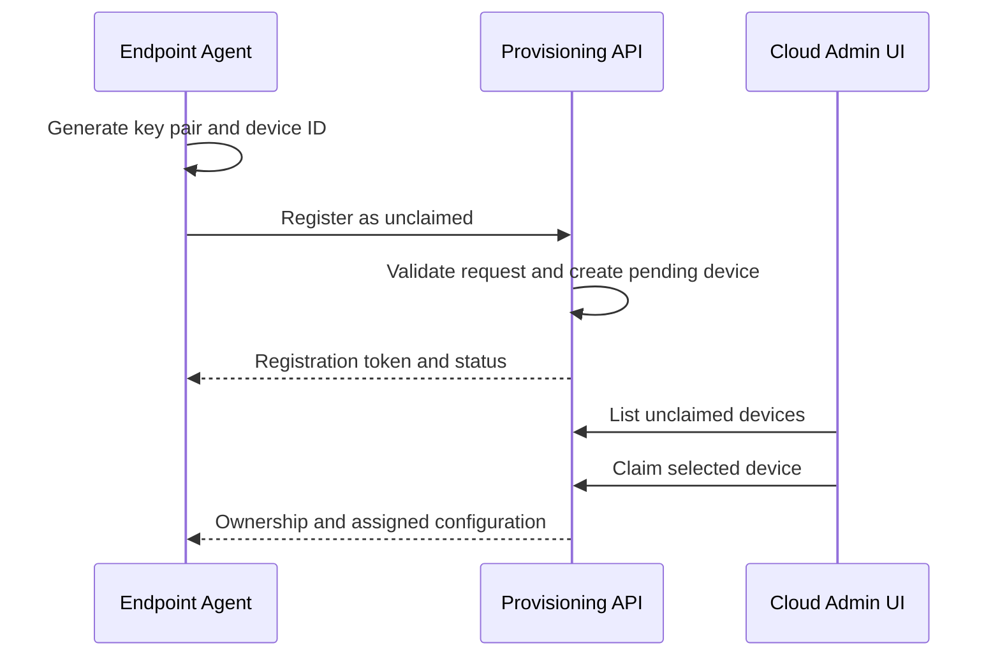
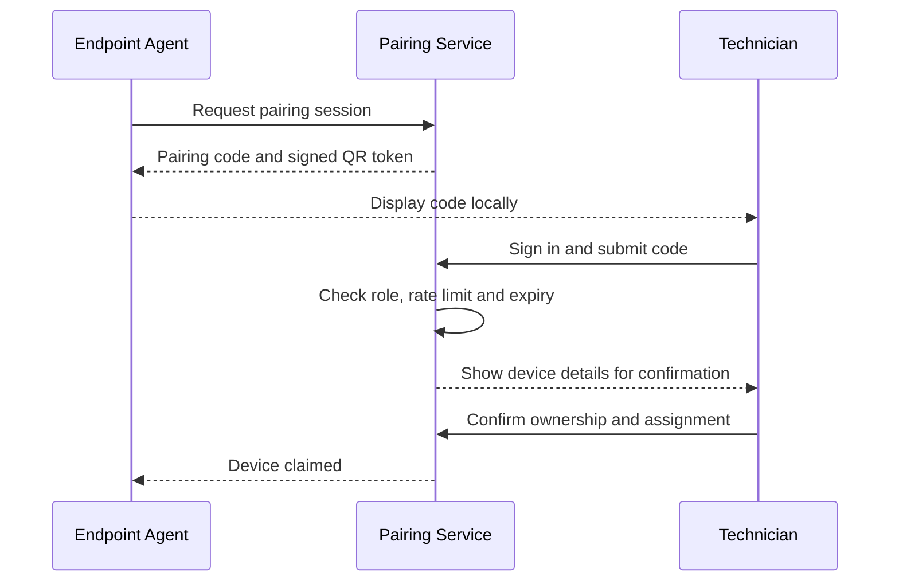

# Device Identity and Pairing

## Objectives

The device must be easy to install while remaining difficult to impersonate.

The platform should support two onboarding methods:

1. **Automatic unclaimed registration**
2. **Installer pairing code**

Both methods should result in the same permanent claimed device identity.

## Permanent device identity

On first launch, the agent generates:

- A globally unique device ID
- A public/private key pair
- A local installation ID
- A device fingerprint
- A recovery identifier

Example:

```json
{
  "deviceId": "dev_01K0TQ6M4W...",
  "installationId": "inst_01K0TQ6Q...",
  "publicKey": "base64-public-key",
  "fingerprint": "SHA256:8F:2B:..."
}
```

The private key must:

- Be generated on the endpoint
- Never be sent to the cloud
- Be stored using Windows-protected storage where possible
- Be replaceable through a controlled recovery process

## Device fingerprint

A fingerprint may include stable hardware facts such as:

- TPM identity where available
- BIOS or system UUID
- Motherboard serial
- Storage serial
- Network adapter identifiers

The fingerprint should not be the sole identity. Hardware values can change and may be missing or duplicated.

Use it for:

- Fraud detection
- Clone detection
- Support diagnostics
- Re-enrolment warnings

## Method A: automatic unclaimed registration

### Flow



### How admins identify the device

The endpoint reports non-sensitive commissioning information:

- Device display name
- Windows computer name
- Hardware model
- Agent version
- Local IP address
- Site code if preconfigured
- Short fingerprint
- Time first seen

The cloud UI might display:

```text
Unclaimed Device
Name: BE-MEDIA-001
Model: AJA Bridge Live Conversion
First Seen: 14 July 2026 16:30
Fingerprint: 8F2B-11A9
Local IP: 10.20.4.31
```

### Security consideration

Automatic appearance should not mean automatic trust.

An unclaimed device must not receive:

- Company secrets
- Production configuration
- User data
- Remote commands
- Software deployment rights

It can only:

- Register
- Refresh its pending status
- Receive a limited pairing challenge
- Download a public bootstrap update

## Method B: pairing code

### Flow



### Recommended code properties

- 6 or 8 digits
- Expires after 5 to 10 minutes
- One-time use
- Rate limited
- Bound to one device
- Invalidated after successful claim
- Regenerated on request
- Never used as a permanent credential

### QR code

The QR code should contain a signed one-time URL, not the device's permanent secret.

Example:

```text
https://control.example.com/pair?t=<signed-one-time-token>
```

## Claim confirmation

Before claiming, show:

- Device name
- Hardware model
- Fingerprint
- Local display confirmation phrase
- Current site if known

For higher security, display a confirmation phrase on both screens:

```text
Device screen: BLUE RIVER 47
Cloud screen: Confirm that the device displays BLUE RIVER 47
```

## Device ownership states

```text
unregistered
pending
unclaimed
claimed
suspended
retired
transferred
revoked
```

## Transfer process

Device transfer must be explicit.

Recommended flow:

1. Current owner initiates transfer or platform admin approves it.
2. Device is removed from room assignments.
3. Company configuration is deleted from the endpoint.
4. Existing device certificate is revoked.
5. Device returns to an unclaimed state.
6. A new organisation claims it.
7. A new certificate is issued.

## Recovery process

If the local identity is lost:

- Do not silently create a second production device.
- Register as a recovery candidate.
- Compare the hardware fingerprint to retired or offline devices.
- Require an administrator to approve identity replacement.
- Revoke the old certificate.
- Record the recovery in the audit log.

## Recommended Phase 1 choice

Implement both onboarding methods, but make pairing code the primary installer experience.

Automatic unclaimed registration remains useful for workshops where many prepared devices should appear in a staging queue.
