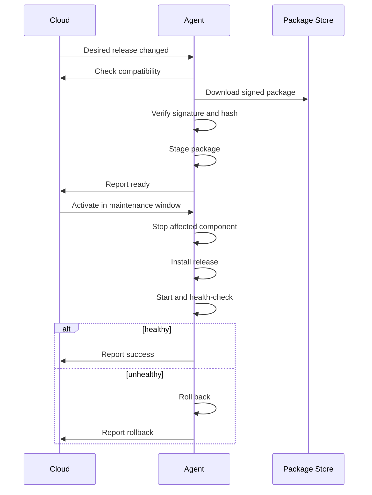

# Offline Operation, Recovery and Updates

## Offline objective

Loss of cloud connectivity must not stop the room, signage or media function already running on the endpoint.

The cloud is the control plane. The endpoint remains responsible for real-time operation.

## Cached information

The endpoint should cache:

- Active configuration
- Previous known-good configuration
- Published presets
- Required media
- Current room assignment
- Permission rules needed for local safety
- Installed application packages
- Update rollback package
- Pending telemetry
- Pending audit events

## Behaviour during network loss

The endpoint should:

- Keep local applications running
- Maintain current output
- Continue local schedules
- Continue approved local control where implemented
- Queue telemetry
- Queue audit events
- Retry cloud connection with backoff
- Display an offline warning only when appropriate
- Avoid repeatedly restarting healthy local applications

## Reconnection

On reconnect:

```text
Authenticate
    ↓
Exchange time and revisions
    ↓
Upload important queued events
    ↓
Compare desired configuration
    ↓
Resolve state differences
    ↓
Resume live commands
```

Do not blindly replay expired live commands.

## Command expiry

Commands should have short expiry times.

Examples:

```text
Select source: 10 seconds
Set volume: 15 seconds
Restart application: 60 seconds
Deploy configuration: 30 minutes
```

An offline endpoint must not apply an old source-selection command after reconnecting hours later.

## Desired state

Durable requirements should be represented as desired state rather than short-lived commands.

Examples:

- Required configuration revision
- Required software release
- Assigned room
- Enabled adapter
- Startup preset

## Process supervision

The agent should monitor:

- TouchDesigner process exists
- Local heartbeat is current
- Project version matches
- GPU output remains active
- Adapter is responsive
- Crash frequency is acceptable

Restart policy example:

```text
First failure: restart immediately
Second failure within 10 minutes: restart after 10 seconds
Third failure within 10 minutes: restart after 60 seconds
Repeated failures: enter degraded state and stop crash loop
```

## Windows reboot recovery

After reboot:

1. Agent service starts automatically.
2. Last known configuration loads.
3. Required user-session renderer starts.
4. TouchDesigner starts in Perform Mode.
5. Local output resumes before cloud control is available where possible.
6. Cloud connection resumes.
7. Device reports reboot reason and state.

## Configuration rollback

Before activating a new configuration:

- Validate schema
- Check adapter compatibility
- Confirm required media exists
- Save current active revision
- Apply new revision
- Run health check
- Roll back on failure

## Software update flow



## Deployment rings

Use staged releases:

```text
Development
Internal Test
Workshop
Pilot Rooms
Production
```

A release must be promoted deliberately.

## Update ownership

Separate updates for:

- Endpoint Agent
- TouchDesigner Adapter
- TouchDesigner Project
- Media Bundle
- Room Configuration
- Web UI

A logo change should not require an agent update.

## Maintenance windows

Support:

- Install now
- Install at next reboot
- Install at scheduled time
- Download now, activate later
- Do not interrupt active room session

## Disk protection

The agent should monitor free space and remove:

- Superseded package caches
- Old diagnostic bundles
- Expired temporary media
- Uploaded logs already confirmed by cloud

Always retain:

- Current package
- Previous known-good package
- Current configuration
- Previous known-good configuration

## Recovery mode

Provide a safe recovery mode that:

- Starts the agent
- Does not start unstable product adapters
- Connects to the cloud
- Allows rollback
- Exposes diagnostics
- Prevents repeated crash loops

## Disaster recovery

A replacement device should be able to:

1. Install the agent.
2. Pair with the cloud.
3. Be assigned to the existing room.
4. Download the room configuration.
5. Download required media and adapter versions.
6. Start the service.
7. Replace the failed endpoint without recreating the room.
