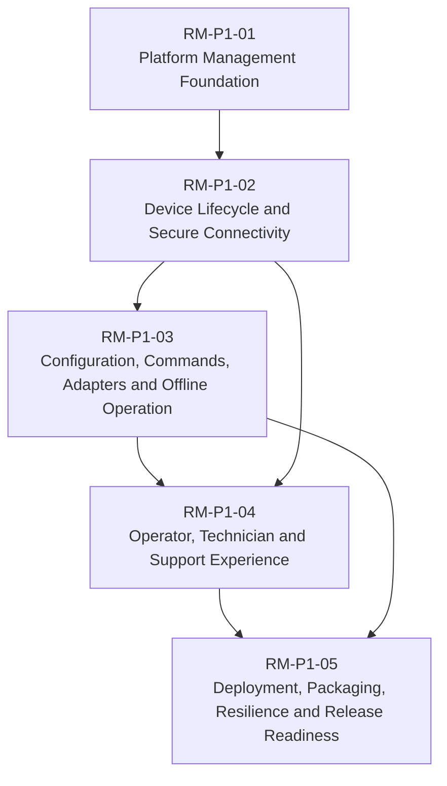

# Phase 1 Roadmaps

This folder organises Phase 1 delivery into three management levels:

```text
Roadmap → Epic → Task
```

Roadmaps describe major capabilities, Epics describe independently reviewable milestones, and Tasks remain the existing less-than-one-day backlog items.

## Roadmaps

- [RM-P1-01 — Platform Management Foundation](RM-P1-01.md)
- [RM-P1-02 — Device Lifecycle and Secure Connectivity](RM-P1-02.md)
- [RM-P1-03 — Configuration, Commands, Adapters and Offline Operation](RM-P1-03.md)
- [RM-P1-04 — Operator, Technician and Support Experience](RM-P1-04.md)
- [RM-P1-05 — Deployment, Packaging, Resilience and Release Readiness](RM-P1-05.md)

## Dependency overview



## Epic index

- [P1-EPIC-01 — Repository, Delivery Controls and Documentation Baseline](epics/P1-EPIC-01.md) — RM-P1-01
- [P1-EPIC-02 — Contracts, Schemas, Fixtures and Error Catalogue](epics/P1-EPIC-02.md) — RM-P1-01
- [P1-EPIC-03 — Cloud Database Migrations and Seed Data](epics/P1-EPIC-03.md) — RM-P1-01
- [P1-EPIC-04 — Cloud Provisioning, Identity, Pairing and Assignment](epics/P1-EPIC-04.md) — RM-P1-02
- [P1-EPIC-05 — Endpoint Agent Foundation](epics/P1-EPIC-05.md) — RM-P1-02
- [P1-EPIC-06 — Real-Time Gateway, Presence, Commands and State Transport](epics/P1-EPIC-06.md) — RM-P1-02
- [P1-EPIC-07 — Configuration, Desired State, Assets and Release Metadata](epics/P1-EPIC-07.md) — RM-P1-03
- [P1-EPIC-08 — Endpoint Command, State, Configuration and Offline Operation](epics/P1-EPIC-08.md) — RM-P1-03
- [P1-EPIC-09 — Adapter Host, Simulator and TouchDesigner Adapter](epics/P1-EPIC-09.md) — RM-P1-03
- [P1-EPIC-10 — Phase 1 Web Application Screens](epics/P1-EPIC-10.md) — RM-P1-04
- [P1-EPIC-11 — Monitoring, Diagnostics, Support and Security Hardening](epics/P1-EPIC-11.md) — RM-P1-04
- [P1-EPIC-12 — Packaging, Deployment, Infrastructure and Package Validation](epics/P1-EPIC-12.md) — RM-P1-05
- [P1-EPIC-13 — End-to-End Acceptance, Resilience and Operational Readiness](epics/P1-EPIC-13.md) — RM-P1-05

## Source backlog

- [Phase 1 Engineering Backlog](../tasks/PHASE_1_ENGINEERING_BACKLOG.md)
