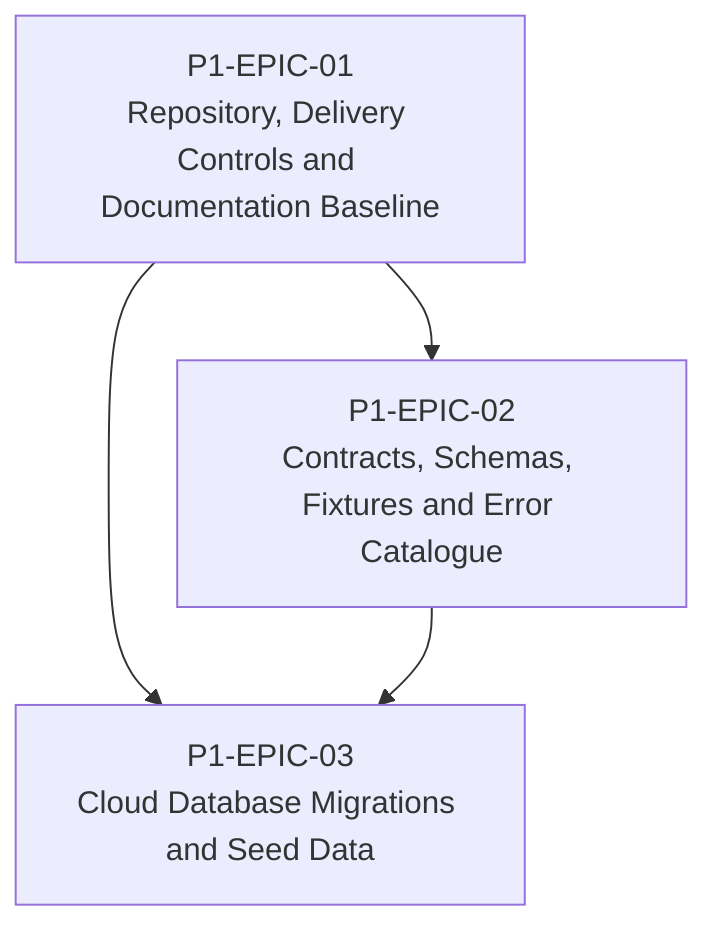

# RM-P1-01 — Platform Management Foundation

## Major capability

Establish the delivery controls, contracts and code-owned data foundation required before feature implementation.

## Epics

- [P1-EPIC-01 — Repository, Delivery Controls and Documentation Baseline](epics/P1-EPIC-01.md)
- [P1-EPIC-02 — Contracts, Schemas, Fixtures and Error Catalogue](epics/P1-EPIC-02.md)
- [P1-EPIC-03 — Cloud Database Migrations and Seed Data](epics/P1-EPIC-03.md)

## ADR cross-reference

- [ADR-003](../decisions/ADR-003-what-is-the-source-of-truth-for-database-infrastructure-and-configurat.md)
- [ADR-026](../decisions/ADR-026-phase-1-mvp.md)
- [ADR-030](../decisions/ADR-030-how-should-ai-coding-agents-be-given-authority-to-implement-the-platfo.md)
- [ADR-031](../decisions/ADR-031-what-is-the-required-ai-agent-change-process.md)

## Dependency diagram

## Roadmap review gate

- All Epics in this Roadmap meet their Epic review gates.
- ADR checkpoints listed by the Epics are resolved before dependent implementation.
- No scope is added beyond Phase 1.
- Task completion evidence is recorded in the linked tasks.
