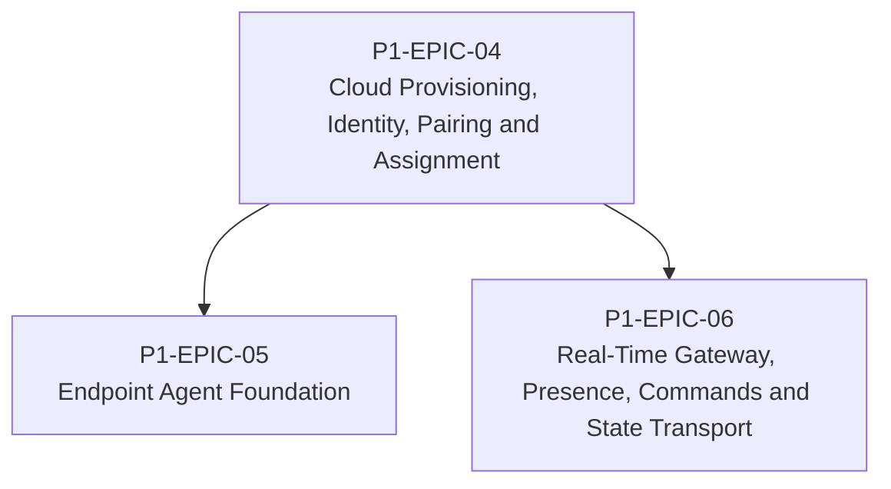

# RM-P1-02 — Device Lifecycle and Secure Connectivity

## Major capability

Deliver the trusted device lifecycle from unclaimed registration through pairing, assignment, secure connection, presence and command transport.

## Epics

- [P1-EPIC-04 — Cloud Provisioning, Identity, Pairing and Assignment](epics/P1-EPIC-04.md)
- [P1-EPIC-05 — Endpoint Agent Foundation](epics/P1-EPIC-05.md)
- [P1-EPIC-06 — Real-Time Gateway, Presence, Commands and State Transport](epics/P1-EPIC-06.md)

## ADR cross-reference

- [ADR-001](../decisions/ADR-001-can-a-node-move-between-networks-or-public-ip-addresses-without-re-pai.md)
- [ADR-002](../decisions/ADR-002-how-is-communication-between-cloud-services-and-nodes-encrypted.md)
- [ADR-011](../decisions/ADR-011-what-is-the-default-device-lifecycle.md)
- [ADR-014](../decisions/ADR-014-room-control-sessions.md)
- [ADR-026](../decisions/ADR-026-phase-1-mvp.md)
- [ADR-028](../decisions/ADR-028-what-tenancy-model-should-be-used-initially-and-for-future-external-cu.md)

## Dependency diagram

## Roadmap review gate

- All Epics in this Roadmap meet their Epic review gates.
- ADR checkpoints listed by the Epics are resolved before dependent implementation.
- No scope is added beyond Phase 1.
- Task completion evidence is recorded in the linked tasks.
