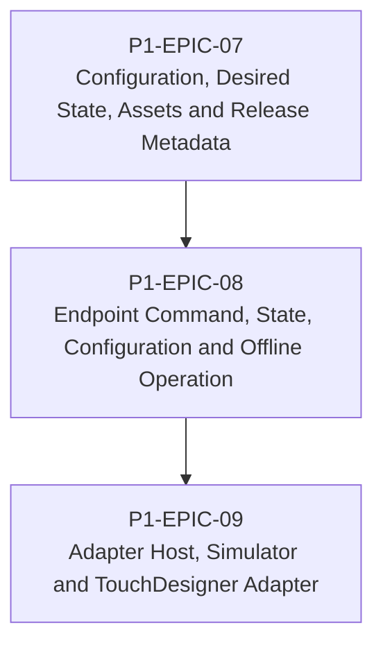

# RM-P1-03 — Configuration, Commands, Adapters and Offline Operation

## Major capability

Deliver desired configuration, endpoint execution, state reporting, simulator and TouchDesigner adapter operation without exposing hardware paths.

## Epics

- [P1-EPIC-07 — Configuration, Desired State, Assets and Release Metadata](epics/P1-EPIC-07.md)
- [P1-EPIC-08 — Endpoint Command, State, Configuration and Offline Operation](epics/P1-EPIC-08.md)
- [P1-EPIC-09 — Adapter Host, Simulator and TouchDesigner Adapter](epics/P1-EPIC-09.md)

## ADR cross-reference

- [ADR-004](../decisions/ADR-004-must-a-node-remain-controllable-when-cloud-access-is-unavailable.md)
- [ADR-005](../decisions/ADR-005-what-level-of-offline-control-is-permitted.md)
- [ADR-008](../decisions/ADR-008-should-cloud-controls-address-physical-devices-directly.md)
- [ADR-009](../decisions/ADR-009-what-happens-if-local-settings-drift-from-the-published-cloud-configur.md)
- [ADR-012](../decisions/ADR-012-should-long-term-settings-use-commands-or-desired-state.md)
- [ADR-015](../decisions/ADR-015-hardware-abstraction.md)
- [ADR-016](../decisions/ADR-016-supported-adapters-in-phase-1.md)
- [ADR-017](../decisions/ADR-017-preset-execution.md)
- [ADR-018](../decisions/ADR-018-offline-programming.md)
- [ADR-020](../decisions/ADR-020-media-asset-management.md)
- [ADR-021](../decisions/ADR-021-monitoring.md)
- [ADR-026](../decisions/ADR-026-phase-1-mvp.md)
- [ADR-027](../decisions/ADR-027-should-the-system-add-fallback-paths-when-the-primary-implementation-f.md)
- [ADR-032](../decisions/ADR-032-can-the-node-support-engines-other-than-touchdesigner.md)

## Dependency diagram

## Roadmap review gate

- All Epics in this Roadmap meet their Epic review gates.
- ADR checkpoints listed by the Epics are resolved before dependent implementation.
- No scope is added beyond Phase 1.
- Task completion evidence is recorded in the linked tasks.
