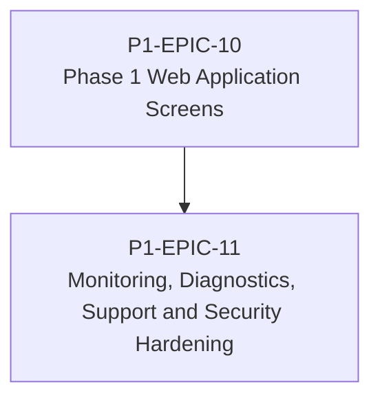

# RM-P1-04 — Operator, Technician and Support Experience

## Major capability

Deliver the browser and support surfaces needed to commission, operate, diagnose and audit the Phase 1 platform safely.

## Epics

- [P1-EPIC-10 — Phase 1 Web Application Screens](epics/P1-EPIC-10.md)
- [P1-EPIC-11 — Monitoring, Diagnostics, Support and Security Hardening](epics/P1-EPIC-11.md)

## ADR cross-reference

- [ADR-002](../decisions/ADR-002-how-is-communication-between-cloud-services-and-nodes-encrypted.md)
- [ADR-008](../decisions/ADR-008-should-cloud-controls-address-physical-devices-directly.md)
- [ADR-011](../decisions/ADR-011-what-is-the-default-device-lifecycle.md)
- [ADR-014](../decisions/ADR-014-room-control-sessions.md)
- [ADR-019](../decisions/ADR-019-time-standard.md)
- [ADR-021](../decisions/ADR-021-monitoring.md)
- [ADR-022](../decisions/ADR-022-telemetry-retention.md)
- [ADR-023](../decisions/ADR-023-remote-support.md)
- [ADR-026](../decisions/ADR-026-phase-1-mvp.md)
- [ADR-028](../decisions/ADR-028-what-tenancy-model-should-be-used-initially-and-for-future-external-cu.md)

## Dependency diagram

## Roadmap review gate

- All Epics in this Roadmap meet their Epic review gates.
- ADR checkpoints listed by the Epics are resolved before dependent implementation.
- No scope is added beyond Phase 1.
- Task completion evidence is recorded in the linked tasks.
