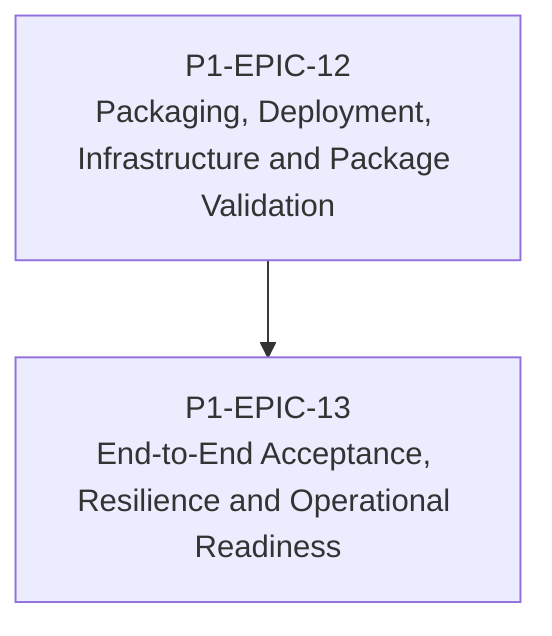

# RM-P1-05 — Deployment, Packaging, Resilience and Release Readiness

## Major capability

Deliver code-owned deployment, installer packaging, package validation, resilience testing and final demonstration readiness.

## Epics

- [P1-EPIC-12 — Packaging, Deployment, Infrastructure and Package Validation](epics/P1-EPIC-12.md)
- [P1-EPIC-13 — End-to-End Acceptance, Resilience and Operational Readiness](epics/P1-EPIC-13.md)

## ADR cross-reference

- [ADR-001](../decisions/ADR-001-can-a-node-move-between-networks-or-public-ip-addresses-without-re-pai.md)
- [ADR-002](../decisions/ADR-002-how-is-communication-between-cloud-services-and-nodes-encrypted.md)
- [ADR-003](../decisions/ADR-003-what-is-the-source-of-truth-for-database-infrastructure-and-configurat.md)
- [ADR-004](../decisions/ADR-004-must-a-node-remain-controllable-when-cloud-access-is-unavailable.md)
- [ADR-008](../decisions/ADR-008-should-cloud-controls-address-physical-devices-directly.md)
- [ADR-010](../decisions/ADR-010-how-are-agent-adapter-touchdesigner-and-schema-versions-kept-compatibl.md)
- [ADR-011](../decisions/ADR-011-what-is-the-default-device-lifecycle.md)
- [ADR-012](../decisions/ADR-012-should-long-term-settings-use-commands-or-desired-state.md)
- [ADR-016](../decisions/ADR-016-supported-adapters-in-phase-1.md)
- [ADR-024](../decisions/ADR-024-touchdesigner-licensing.md)
- [ADR-026](../decisions/ADR-026-phase-1-mvp.md)
- [ADR-027](../decisions/ADR-027-should-the-system-add-fallback-paths-when-the-primary-implementation-f.md)
- [ADR-029](../decisions/ADR-029-how-should-client-deployments-be-created.md)

## Dependency diagram

## Roadmap review gate

- All Epics in this Roadmap meet their Epic review gates.
- ADR checkpoints listed by the Epics are resolved before dependent implementation.
- No scope is added beyond Phase 1.
- Task completion evidence is recorded in the linked tasks.
