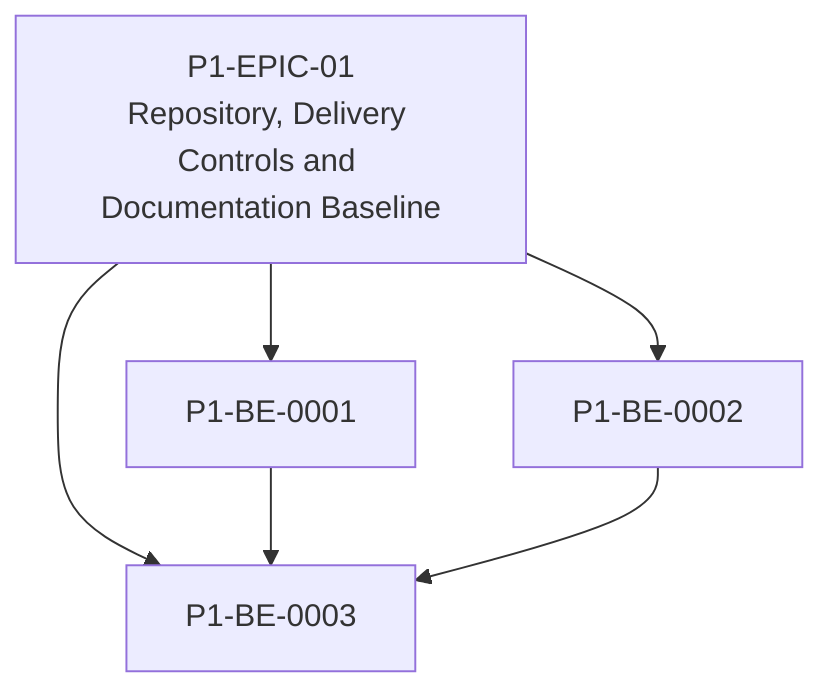

# P1-EPIC-01 — Repository, Delivery Controls and Documentation Baseline

**Roadmap:** [RM-P1-01](../RM-P1-01.md)

## Goal

Create the repository and process baseline needed before implementation starts.

## Scope

This Epic groups closely related Phase 1 management tasks from the existing engineering backlog. It is a planning document only and does not introduce code changes or new architecture.

## Tasks

- [x] [P1-BE-0001](../../tasks/PHASE_1_ENGINEERING_BACKLOG.md#p1-be-0001-establish-phase-1-repository-structure) — Establish Phase 1 repository structure
- [x] [P1-BE-0002](../../tasks/PHASE_1_ENGINEERING_BACKLOG.md#p1-be-0002-define-task-completion-checklist) — Define task completion checklist
- [x] [P1-BE-0003](../../tasks/PHASE_1_ENGINEERING_BACKLOG.md#p1-be-0003-add-initial-automated-documentation-checks) — Add initial automated documentation checks

## Dependencies

- None

## ADR cross-reference

- [ADR-003](../../decisions/ADR-003-what-is-the-source-of-truth-for-database-infrastructure-and-configurat.md)
- [ADR-026](../../decisions/ADR-026-phase-1-mvp.md)
- [ADR-030](../../decisions/ADR-030-how-should-ai-coding-agents-be-given-authority-to-implement-the-platfo.md)
- [ADR-031](../../decisions/ADR-031-what-is-the-required-ai-agent-change-process.md)

## Dependency diagram

## Implementation status

- Status: Complete.
- Completed tasks: P1-BE-0001, P1-BE-0002 and P1-BE-0003.
- Review Gate: reached; do not proceed into Epic 2 until review completes.

## Review Gate checklist

- Task links point to the authoritative Phase 1 Engineering Backlog.
- Referenced ADRs have been reviewed for the task scope.
- Any proposed or in-review ADR dependency is handled by a Decision Request before implementation.
- Deliverables remain inside Phase 1 and do not create new architecture.
- Completion evidence covers behaviour, files, tests, migrations, contracts, documentation, limitations, rollback notes and ADRs.

## Epic Readiness Review

### Readiness conclusion

Epic 1 is implementation ready.

The review found the Epic internally consistent after clarifying that the automated documentation checks depend on the task completion checklist as well as the repository structure. The Epic remains a documentation and delivery-control baseline only; it does not approve runtime behaviour, new services, public APIs, database entities, permission boundaries, adapter contracts or Phase 1 scope expansion.

### Task dependency review

| Task | Dependency status | Review result |
| --- | --- | --- |
| P1-BE-0001 | No prerequisite tasks. | Ready to start first. |
| P1-BE-0002 | No prerequisite tasks. | Ready to start after or in parallel with P1-BE-0001, but should be completed before P1-BE-0003 so checks can validate the agreed completion metadata. |
| P1-BE-0003 | Depends on P1-BE-0001 and P1-BE-0002. | Ready after the repository structure and completion checklist exist. |

### ADR and architecture review

| ADR | Epic impact | Review result |
| --- | --- | --- |
| ADR-003 | Requires code-owned repository, database, infrastructure and configuration changes; this Epic only creates structure and checks. | No conflict. No database or infrastructure changes are approved unless represented as source-controlled files. |
| ADR-026 | Limits Phase 1 to the single-company, single-room, single-node MVP. | No conflict. The Epic creates process baseline only and does not expand MVP behaviour. |
| ADR-030 | Requires controlled documentation hierarchy and forbids agents from inventing architecture, permissions, schema changes or fallbacks. | No conflict. This Epic strengthens delivery controls. |
| ADR-031 | Requires scoped tasks, ADR references, tests/checks and Decision Requests for unapproved choices. | No conflict. P1-BE-0002 and P1-BE-0003 directly support this ADR. |

### Missing, duplicated or merged tasks

- Missing tasks: none required for this Epic. The three tasks cover repository layout, task completion evidence and initial automated documentation checks.
- Duplicated tasks: none. P1-BE-0002 defines the checklist; P1-BE-0003 automates validation against the checklist and documentation links, so they should remain separate.
- Merge recommendation: none.

### Optimal execution sequence

1. P1-BE-0001 — Establish Phase 1 repository structure.
2. P1-BE-0002 — Define task completion checklist.
3. P1-BE-0003 — Add initial automated documentation checks.

P1-BE-0001 and P1-BE-0002 may be prepared in parallel, but P1-BE-0003 must finish after both so the automated checks validate the final repository layout and required task evidence.

### Expected deliverables

- Source-controlled Phase 1 top-level implementation directories with placeholder READMEs for ownership, build commands, test commands and related specifications.
- A reusable task completion checklist covering behaviour, files changed, tests/checks, migrations, contracts, documentation, known limitations, rollback/recovery notes and ADR references.
- Initial documentation checks for required task metadata and broken relative documentation links, with local and CI run instructions.
- Confirmation that no runtime behaviour, migrations, cloud APIs, database entities, adapter contracts or infrastructure resources are implemented by this Epic unless explicitly represented as non-runtime placeholders.

### Estimated review checkpoints

1. After P1-BE-0001: verify directory names match the Phase 1 Build Plan and README placeholders do not define unapproved services or runtime behaviour.
2. After P1-BE-0002: verify the checklist satisfies AGENTS.md, ADR-030 and ADR-031 completion-evidence requirements and requires Decision Requests for material ambiguity.
3. After P1-BE-0003: run the documentation checks locally, verify CI instructions are documented, and confirm checks fail visibly rather than hiding documentation errors.

### Risks

- Placeholder READMEs could accidentally imply approved service boundaries or public APIs before architecture/contracts authorize them.
- Documentation checks could become too broad and block future work on requirements not yet approved; keep them limited to required metadata and relative links.
- Completion checklist wording could drift from AGENTS.md or the Development Playbook; reviewers must compare it against the source-of-truth hierarchy.

### Decision Requests

None required. No material ambiguity remains for this Epic.
