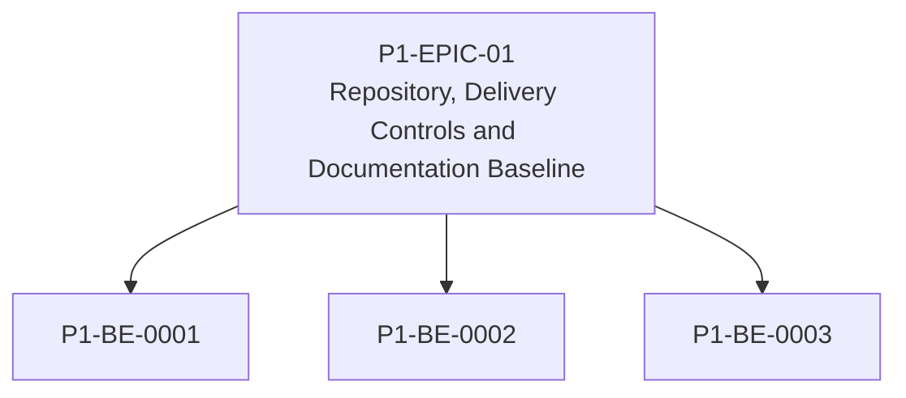

# P1-EPIC-01 — Repository, Delivery Controls and Documentation Baseline

**Roadmap:** [RM-P1-01](../RM-P1-01.md)

## Goal

Create the repository and process baseline needed before implementation starts.

## Scope

This Epic groups closely related Phase 1 management tasks from the existing engineering backlog. It is a planning document only and does not introduce code changes or new architecture.

## Tasks

- [P1-BE-0001](../../tasks/PHASE_1_ENGINEERING_BACKLOG.md#p1-be-0001-establish-phase-1-repository-structure) — Establish Phase 1 repository structure
- [P1-BE-0002](../../tasks/PHASE_1_ENGINEERING_BACKLOG.md#p1-be-0002-define-task-completion-checklist) — Define task completion checklist
- [P1-BE-0003](../../tasks/PHASE_1_ENGINEERING_BACKLOG.md#p1-be-0003-add-initial-automated-documentation-checks) — Add initial automated documentation checks

## Dependencies

- None

## ADR cross-reference

- [ADR-003](../../decisions/ADR-003-what-is-the-source-of-truth-for-database-infrastructure-and-configurat.md)
- [ADR-026](../../decisions/ADR-026-phase-1-mvp.md)
- [ADR-030](../../decisions/ADR-030-how-should-ai-coding-agents-be-given-authority-to-implement-the-platfo.md)
- [ADR-031](../../decisions/ADR-031-what-is-the-required-ai-agent-change-process.md)

## Dependency diagram

## Review Gate checklist

- Task links point to the authoritative Phase 1 Engineering Backlog.
- Referenced ADRs have been reviewed for the task scope.
- Any proposed or in-review ADR dependency is handled by a Decision Request before implementation.
- Deliverables remain inside Phase 1 and do not create new architecture.
- Completion evidence covers behaviour, files, tests, migrations, contracts, documentation, limitations, rollback notes and ADRs.
