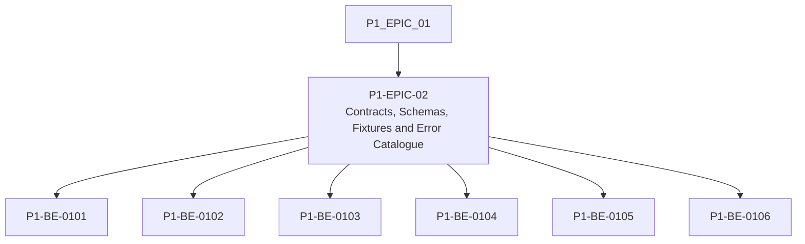

# P1-EPIC-02 — Contracts, Schemas, Fixtures and Error Catalogue

**Roadmap:** [RM-P1-01](../RM-P1-01.md)

## Goal

Define stable machine-readable API, message, configuration, capability and error contracts before implementation.

## Scope

This Epic groups closely related Phase 1 management tasks from the existing engineering backlog. It is a planning document only and does not introduce code changes or new architecture.

## Tasks

- [x] [P1-BE-0101](../../tasks/PHASE_1_ENGINEERING_BACKLOG.md#p1-be-0101-create-websocket-message-schemas) — Create WebSocket message schemas
- [x] [P1-BE-0102](../../tasks/PHASE_1_ENGINEERING_BACKLOG.md#p1-be-0102-create-rest-contract-stubs-for-provisioning-and-device-apis) — Create REST contract stubs for provisioning and device APIs
- [x] [P1-BE-0103](../../tasks/PHASE_1_ENGINEERING_BACKLOG.md#p1-be-0103-create-command-api-contract) — Create command API contract
- [x] [P1-BE-0104](../../tasks/PHASE_1_ENGINEERING_BACKLOG.md#p1-be-0104-create-capability-manifest-schema) — Create capability manifest schema
- [x] [P1-BE-0105](../../tasks/PHASE_1_ENGINEERING_BACKLOG.md#p1-be-0105-create-room-configuration-and-preset-schemas) — Create room configuration and preset schemas
- [x] [P1-BE-0106](../../tasks/PHASE_1_ENGINEERING_BACKLOG.md#p1-be-0106-create-canonical-error-code-catalogue) — Create canonical error-code catalogue

## Dependencies

- [P1-EPIC-01](P1-EPIC-01.md)

## ADR cross-reference

- [ADR-002](../../decisions/ADR-002-how-is-communication-between-cloud-services-and-nodes-encrypted.md)
- [ADR-008](../../decisions/ADR-008-should-cloud-controls-address-physical-devices-directly.md)
- [ADR-012](../../decisions/ADR-012-should-long-term-settings-use-commands-or-desired-state.md)
- [ADR-013](../../decisions/ADR-013-command-priority.md)
- [ADR-015](../../decisions/ADR-015-hardware-abstraction.md)
- [ADR-016](../../decisions/ADR-016-supported-adapters-in-phase-1.md)
- [ADR-017](../../decisions/ADR-017-preset-execution.md)
- [ADR-019](../../decisions/ADR-019-time-standard.md)
- [ADR-020](../../decisions/ADR-020-media-asset-management.md)
- [ADR-021](../../decisions/ADR-021-monitoring.md)
- [ADR-023](../../decisions/ADR-023-remote-support.md)
- [ADR-026](../../decisions/ADR-026-phase-1-mvp.md)
- [ADR-027](../../decisions/ADR-027-should-the-system-add-fallback-paths-when-the-primary-implementation-f.md)
- [ADR-032](../../decisions/ADR-032-can-the-node-support-engines-other-than-touchdesigner.md)

## Dependency diagram

## Review Gate checklist

- Task links point to the authoritative Phase 1 Engineering Backlog.
- Referenced ADRs have been reviewed for the task scope.
- Any proposed or in-review ADR dependency is handled by a Decision Request before implementation.
- Deliverables remain inside Phase 1 and do not create new architecture.
- Completion evidence covers behaviour, files, tests, migrations, contracts, documentation, limitations, rollback notes and ADRs.

## Implementation status

- Status: Complete.
- Completed tasks: P1-BE-0101, P1-BE-0102, P1-BE-0103, P1-BE-0104, P1-BE-0105 and P1-BE-0106.
- Review Gate: reached; do not proceed into Epic 3 until review completes.

## Epic Completion Report

### Executive summary

Epic 2 adds the initial source-controlled Phase 1 contract baseline: WebSocket message schemas and fixtures, REST/OpenAPI stubs, command API contracts, capability manifest schema, room configuration and preset schemas, and the canonical error-code catalogue.

### Deliverables

- WebSocket message schemas and valid/invalid fixtures for all Phase 1 gateway messages.
- Node provisioning/device/configuration OpenAPI stubs with separated node and user authentication schemes.
- Operator command OpenAPI stubs limited to approved Phase 1 logical actions.
- Phase 1 capability manifest schema and single-node fixture for TouchDesigner and System Health adapters.
- Room configuration and preset schemas with desired-state configuration and asset-ID references.
- Canonical Phase 1 error-code catalogue with user-safe messages and diagnostic guidance.
- Contract validation script wired into the repository aggregate check.

### Validation evidence

- `npm run check:contracts` validates required schemas, fixtures, logical actions, UTC timestamp expectations, error categories and hardware-path exclusions.
- `npm run check` runs documentation validation and contract validation.

### Documentation updates

- `contracts/README.md` documents the contract directory contents and validation command.
- `tests/README.md` documents the current validation commands.
- Epic and backlog progress are updated to mark Epic 2 tasks complete.

### Contract updates

Contracts were the primary deliverable for this epic. No runtime APIs were implemented.

### Migration summary

No database migrations were required or added.

### Known limitations

- OpenAPI files are stubs for approved Phase 1 endpoints and do not implement services.
- Contract validation is intentionally lightweight and repository-local; fuller JSON Schema/OpenAPI tooling can be introduced by a later approved tooling task.

### Recovery / rollback notes

Revert the Epic 2 contract files, validation script, package script updates and documentation progress updates to return to the previous placeholder-only contract baseline.

### Decision Requests

None.

### Referenced ADRs

ADR-002, ADR-008, ADR-012, ADR-013, ADR-015, ADR-016, ADR-017, ADR-019, ADR-020, ADR-021, ADR-023, ADR-026, ADR-027 and ADR-032.

### Recommendation

Proceed to Review Gate approval for Epic 2. Do not begin Epic 3 until the Review Gate is approved.

## Engineering Scorecard

| Area | Rating | Notes |
| --- | --- | --- |
| Architecture Compliance | ★★★★★ | Contracts stay within approved Phase 1 boundaries and expose logical capabilities only. |
| Platform Principle Compliance | ★★★★★ | Code-owned contracts and tests were added without fallback behaviour or runtime scope expansion. |
| Documentation Quality | ★★★★★ | Contract locations, validation commands and completion evidence are documented. |
| Security | ★★★★★ | Node and user authentication schemes remain separated in contracts; no secrets are introduced. |
| Testing | ★★★★☆ | Repository-local validation covers the required contract baseline; richer schema/OpenAPI validators are deferred to later tooling approval. |
| Maintainability | ★★★★★ | Files are organized by contract domain and fixtures are explicit. |
| Simplicity | ★★★★★ | The implementation is static contracts plus a small validation script. |
| Scope Control | ★★★★★ | No runtime services, database migrations or future adapters were implemented. |
| Technical Debt | ★★★★☆ | Lightweight validation should eventually be replaced or supplemented by full JSON Schema/OpenAPI validation tooling. |

## Engineering Retrospective

- We learned that the roadmap epic numbering maps Epic 2 to backlog tasks P1-BE-0101 through P1-BE-0106, while the backlog heading still labels those tasks as Epic 1.
- No ADR proved incorrect.
- No Platform Principle change is recommended.
- No engineering standard change is recommended.
- Documentation was mostly clear, with the noted epic-numbering mismatch.
- No unnecessary complexity was introduced.
- Technical debt: contract validation is lightweight pending approved tooling.
- No security concerns were identified.
- No performance concerns were identified.
- Nothing drifted outside approved scope.
- No discovered item belongs in a later phase beyond richer tooling.
- The platform is healthier because contracts now exist as source-controlled validation inputs.

## Architecture Guardian Review

- No undocumented architecture has been introduced.
- No speculative fallback behaviour exists.
- Documentation and implementation remain aligned.
- Contracts remain consistent with approved Phase 1 logical capabilities.
- Security has not been weakened.
- The repository is healthier than before this Epic.
