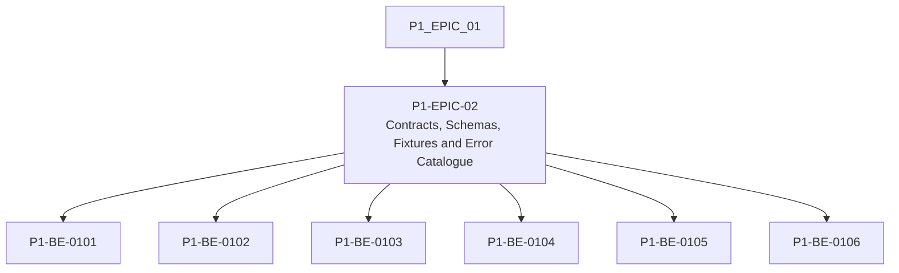

# P1-EPIC-02 — Contracts, Schemas, Fixtures and Error Catalogue

**Roadmap:** [RM-P1-01](../RM-P1-01.md)

## Goal

Define stable machine-readable API, message, configuration, capability and error contracts before implementation.

## Scope

This Epic groups closely related Phase 1 management tasks from the existing engineering backlog. It is a planning document only and does not introduce code changes or new architecture.

## Tasks

- [P1-BE-0101](../../tasks/PHASE_1_ENGINEERING_BACKLOG.md#p1-be-0101-create-websocket-message-schemas) — Create WebSocket message schemas
- [P1-BE-0102](../../tasks/PHASE_1_ENGINEERING_BACKLOG.md#p1-be-0102-create-rest-contract-stubs-for-provisioning-and-device-apis) — Create REST contract stubs for provisioning and device APIs
- [P1-BE-0103](../../tasks/PHASE_1_ENGINEERING_BACKLOG.md#p1-be-0103-create-command-api-contract) — Create command API contract
- [P1-BE-0104](../../tasks/PHASE_1_ENGINEERING_BACKLOG.md#p1-be-0104-create-capability-manifest-schema) — Create capability manifest schema
- [P1-BE-0105](../../tasks/PHASE_1_ENGINEERING_BACKLOG.md#p1-be-0105-create-room-configuration-and-preset-schemas) — Create room configuration and preset schemas
- [P1-BE-0106](../../tasks/PHASE_1_ENGINEERING_BACKLOG.md#p1-be-0106-create-canonical-error-code-catalogue) — Create canonical error-code catalogue

## Dependencies

- [P1-EPIC-01](P1-EPIC-01.md)

## ADR cross-reference

- [ADR-002](../../decisions/ADR-002-how-is-communication-between-cloud-services-and-nodes-encrypted.md)
- [ADR-008](../../decisions/ADR-008-should-cloud-controls-address-physical-devices-directly.md)
- [ADR-012](../../decisions/ADR-012-should-long-term-settings-use-commands-or-desired-state.md)
- [ADR-013](../../decisions/ADR-013-command-priority.md)
- [ADR-015](../../decisions/ADR-015-hardware-abstraction.md)
- [ADR-016](../../decisions/ADR-016-supported-adapters-in-phase-1.md)
- [ADR-017](../../decisions/ADR-017-preset-execution.md)
- [ADR-019](../../decisions/ADR-019-time-standard.md)
- [ADR-020](../../decisions/ADR-020-media-asset-management.md)
- [ADR-021](../../decisions/ADR-021-monitoring.md)
- [ADR-023](../../decisions/ADR-023-remote-support.md)
- [ADR-026](../../decisions/ADR-026-phase-1-mvp.md)
- [ADR-027](../../decisions/ADR-027-should-the-system-add-fallback-paths-when-the-primary-implementation-f.md)
- [ADR-032](../../decisions/ADR-032-can-the-node-support-engines-other-than-touchdesigner.md)

## Dependency diagram

## Review Gate checklist

- Task links point to the authoritative Phase 1 Engineering Backlog.
- Referenced ADRs have been reviewed for the task scope.
- Any proposed or in-review ADR dependency is handled by a Decision Request before implementation.
- Deliverables remain inside Phase 1 and do not create new architecture.
- Completion evidence covers behaviour, files, tests, migrations, contracts, documentation, limitations, rollback notes and ADRs.
