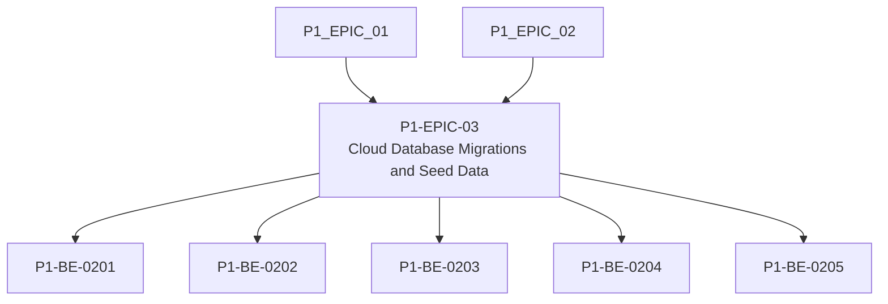

# P1-EPIC-03 — Cloud Database Migrations and Seed Data

**Roadmap:** [RM-P1-01](../RM-P1-01.md)

## Goal

Create the code-owned database foundation for the Phase 1 deployment.

## Scope

This Epic groups closely related Phase 1 management tasks from the existing engineering backlog. It is a planning document only and does not introduce code changes or new architecture.

## Tasks

- [x] [P1-BE-0201](../../tasks/PHASE_1_ENGINEERING_BACKLOG.md#p1-be-0201-add-initial-database-migration-framework) — Add initial database migration framework
- [x] [P1-BE-0202](../../tasks/PHASE_1_ENGINEERING_BACKLOG.md#p1-be-0202-add-identity-company-site-and-room-migrations) — Add identity, company, site and room migrations
- [x] [P1-BE-0203](../../tasks/PHASE_1_ENGINEERING_BACKLOG.md#p1-be-0203-add-device-lifecycle-migrations) — Add device lifecycle migrations
- [x] [P1-BE-0204](../../tasks/PHASE_1_ENGINEERING_BACKLOG.md#p1-be-0204-add-configuration-command-state-and-event-migrations) — Add configuration, command, state and event migrations
- [x] [P1-BE-0205](../../tasks/PHASE_1_ENGINEERING_BACKLOG.md#p1-be-0205-add-release-and-package-metadata-migrations) — Add release and package metadata migrations

## Dependencies

- [P1-EPIC-01](P1-EPIC-01.md)
- [P1-EPIC-02](P1-EPIC-02.md)

## ADR cross-reference

- [ADR-001](../../decisions/ADR-001-can-a-node-move-between-networks-or-public-ip-addresses-without-re-pai.md)
- [ADR-002](../../decisions/ADR-002-how-is-communication-between-cloud-services-and-nodes-encrypted.md)
- [ADR-003](../../decisions/ADR-003-what-is-the-source-of-truth-for-database-infrastructure-and-configurat.md)
- [ADR-010](../../decisions/ADR-010-how-are-agent-adapter-touchdesigner-and-schema-versions-kept-compatibl.md)
- [ADR-011](../../decisions/ADR-011-what-is-the-default-device-lifecycle.md)
- [ADR-012](../../decisions/ADR-012-should-long-term-settings-use-commands-or-desired-state.md)
- [ADR-017](../../decisions/ADR-017-preset-execution.md)
- [ADR-019](../../decisions/ADR-019-time-standard.md)
- [ADR-020](../../decisions/ADR-020-media-asset-management.md)
- [ADR-021](../../decisions/ADR-021-monitoring.md)
- [ADR-022](../../decisions/ADR-022-telemetry-retention.md)
- [ADR-028](../../decisions/ADR-028-what-tenancy-model-should-be-used-initially-and-for-future-external-cu.md)
- [ADR-029](../../decisions/ADR-029-how-should-client-deployments-be-created.md)

## Dependency diagram

## Review Gate checklist

- Task links point to the authoritative Phase 1 Engineering Backlog.
- Referenced ADRs have been reviewed for the task scope.
- Any proposed or in-review ADR dependency is handled by a Decision Request before implementation.
- Deliverables remain inside Phase 1 and do not create new architecture.
- Completion evidence covers behaviour, files, tests, migrations, contracts, documentation, limitations, rollback notes and ADRs.

## Completion status

Completed on 2026-07-15.

Deliverables:

- Ordered PostgreSQL migration framework and tracking tables.
- Identity, company, site and room migrations.
- Device lifecycle, credential, registration, pairing and assignment migrations.
- Configuration, preset, deployment, command, state, device event and audit migrations.
- Release, package assignment and compatibility metadata migrations.
- Idempotent Blue Elephant Phase 1 seed data.
- Database migration validation included in `npm run check`.

Migrations are additive Phase 1 foundation migrations. No manual database changes are required.
