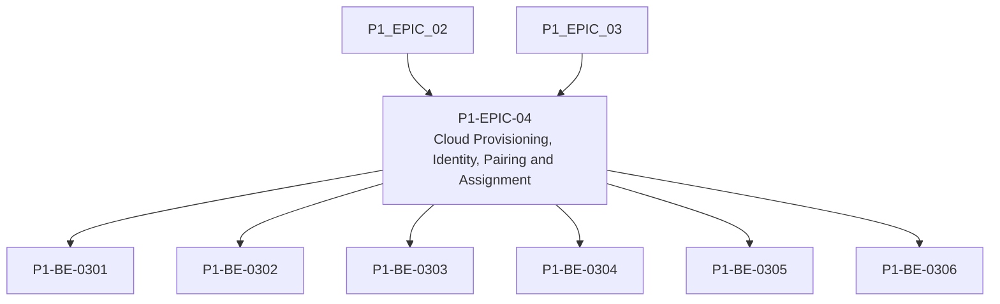

# P1-EPIC-04 — Cloud Provisioning, Identity, Pairing and Assignment

**Roadmap:** [RM-P1-02](../RM-P1-02.md)

## Goal

Allow a new endpoint to register, be claimed, receive a credential and be assigned to the Phase 1 room.

## Scope

This Epic groups closely related Phase 1 management tasks from the existing engineering backlog. It is a planning document only and does not introduce code changes or new architecture.

## Tasks

- [P1-BE-0301](../../tasks/PHASE_1_ENGINEERING_BACKLOG.md#p1-be-0301-implement-unclaimed-device-registration-endpoint) — Implement unclaimed device registration endpoint
- [P1-BE-0302](../../tasks/PHASE_1_ENGINEERING_BACKLOG.md#p1-be-0302-implement-registration-status-polling-endpoint) — Implement registration status polling endpoint
- [P1-BE-0303](../../tasks/PHASE_1_ENGINEERING_BACKLOG.md#p1-be-0303-implement-pairing-session-creation-endpoint) — Implement pairing session creation endpoint
- [P1-BE-0304](../../tasks/PHASE_1_ENGINEERING_BACKLOG.md#p1-be-0304-implement-pairing-claim-endpoint) — Implement pairing claim endpoint
- [P1-BE-0305](../../tasks/PHASE_1_ENGINEERING_BACKLOG.md#p1-be-0305-implement-device-certificate-issuance-record) — Implement device certificate issuance record
- [P1-BE-0306](../../tasks/PHASE_1_ENGINEERING_BACKLOG.md#p1-be-0306-implement-room-assignment-endpoint) — Implement room assignment endpoint

## Dependencies

- [P1-EPIC-02](P1-EPIC-02.md)
- [P1-EPIC-03](P1-EPIC-03.md)

## ADR cross-reference

- [ADR-001](../../decisions/ADR-001-can-a-node-move-between-networks-or-public-ip-addresses-without-re-pai.md)
- [ADR-002](../../decisions/ADR-002-how-is-communication-between-cloud-services-and-nodes-encrypted.md)
- [ADR-008](../../decisions/ADR-008-should-cloud-controls-address-physical-devices-directly.md)
- [ADR-011](../../decisions/ADR-011-what-is-the-default-device-lifecycle.md)
- [ADR-019](../../decisions/ADR-019-time-standard.md)
- [ADR-026](../../decisions/ADR-026-phase-1-mvp.md)
- [ADR-028](../../decisions/ADR-028-what-tenancy-model-should-be-used-initially-and-for-future-external-cu.md)

## Dependency diagram

## Review Gate checklist

- Task links point to the authoritative Phase 1 Engineering Backlog.
- Referenced ADRs have been reviewed for the task scope.
- Any proposed or in-review ADR dependency is handled by a Decision Request before implementation.
- Deliverables remain inside Phase 1 and do not create new architecture.
- Completion evidence covers behaviour, files, tests, migrations, contracts, documentation, limitations, rollback notes and ADRs.
