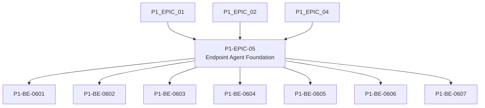

# P1-EPIC-05 — Endpoint Agent Foundation

**Roadmap:** [RM-P1-02](../RM-P1-02.md)

## Goal

Build the minimum Windows endpoint foundation for identity, provisioning, pairing display, secure cloud connection and local diagnostics.

## Scope

This Epic groups closely related Phase 1 management tasks from the existing engineering backlog. It is a planning document only and does not introduce code changes or new architecture.

## Tasks

- [P1-BE-0601](../../tasks/PHASE_1_ENGINEERING_BACKLOG.md#p1-be-0601-create-windows-service-skeleton) — Create Windows service skeleton
- [P1-BE-0602](../../tasks/PHASE_1_ENGINEERING_BACKLOG.md#p1-be-0602-implement-local-sqlite-database-migrations) — Implement local SQLite database migrations
- [P1-BE-0603](../../tasks/PHASE_1_ENGINEERING_BACKLOG.md#p1-be-0603-implement-device-identity-generation-and-protected-storage) — Implement device identity generation and protected storage
- [P1-BE-0604](../../tasks/PHASE_1_ENGINEERING_BACKLOG.md#p1-be-0604-implement-provisioning-client) — Implement provisioning client
- [P1-BE-0605](../../tasks/PHASE_1_ENGINEERING_BACKLOG.md#p1-be-0605-implement-pairing-code-display-data-source) — Implement pairing-code display data source
- [P1-BE-0606](../../tasks/PHASE_1_ENGINEERING_BACKLOG.md#p1-be-0606-implement-cloud-websocket-connection-manager) — Implement cloud WebSocket connection manager
- [P1-BE-0607](../../tasks/PHASE_1_ENGINEERING_BACKLOG.md#p1-be-0607-implement-local-api-for-diagnostics-and-commissioning) — Implement local API for diagnostics and commissioning

## Dependencies

- [P1-EPIC-01](P1-EPIC-01.md)
- [P1-EPIC-02](P1-EPIC-02.md)
- [P1-EPIC-04](P1-EPIC-04.md)

## ADR cross-reference

- [ADR-001](../../decisions/ADR-001-can-a-node-move-between-networks-or-public-ip-addresses-without-re-pai.md)
- [ADR-002](../../decisions/ADR-002-how-is-communication-between-cloud-services-and-nodes-encrypted.md)
- [ADR-003](../../decisions/ADR-003-what-is-the-source-of-truth-for-database-infrastructure-and-configurat.md)
- [ADR-004](../../decisions/ADR-004-must-a-node-remain-controllable-when-cloud-access-is-unavailable.md)
- [ADR-005](../../decisions/ADR-005-what-level-of-offline-control-is-permitted.md)
- [ADR-011](../../decisions/ADR-011-what-is-the-default-device-lifecycle.md)
- [ADR-012](../../decisions/ADR-012-should-long-term-settings-use-commands-or-desired-state.md)
- [ADR-019](../../decisions/ADR-019-time-standard.md)
- [ADR-021](../../decisions/ADR-021-monitoring.md)
- [ADR-023](../../decisions/ADR-023-remote-support.md)
- [ADR-026](../../decisions/ADR-026-phase-1-mvp.md)
- [ADR-031](../../decisions/ADR-031-what-is-the-required-ai-agent-change-process.md)

## Dependency diagram

## Review Gate checklist

- Task links point to the authoritative Phase 1 Engineering Backlog.
- Referenced ADRs have been reviewed for the task scope.
- Any proposed or in-review ADR dependency is handled by a Decision Request before implementation.
- Deliverables remain inside Phase 1 and do not create new architecture.
- Completion evidence covers behaviour, files, tests, migrations, contracts, documentation, limitations, rollback notes and ADRs.
## Completion record

Status: Complete pending Review Gate approval.

Completed tasks:

- P1-BE-0601 — Windows service skeleton implemented with install/remove scripts and structured startup/shutdown logs.
- P1-BE-0602 — Local SQLite migration foundation added with explicit schema-version compatibility validation.
- P1-BE-0603 — Device identity generation added with persistent metadata, private-key reference storage and reboot-stable identity loading.
- P1-BE-0604 — Provisioning client added for unclaimed registration and status polling with explicit failure handling.
- P1-BE-0605 — Pairing-code display source added with expiry/claimed-session protection.
- P1-BE-0606 — Cloud connection manager added for `device.hello`, `server.welcome` and heartbeat flow through a secure transport abstraction.
- P1-BE-0607 — Local diagnostics and commissioning API added with localhost binding, bearer-token protection and constrained diagnostic export trigger.

Completion evidence:

- Tests: `npm run check`, `node --test tests/endpoint-agent.test.mjs`, `git diff --check`.
- Migrations: endpoint local ordered migration `endpoint/migrations/0001_endpoint_agent_foundation.sql`; no cloud database migration required.
- Contracts: existing provisioning and WebSocket contracts reused; no public contract version change required.
- Infrastructure: no infrastructure changes.
- Known limitations: Windows service scripts are scaffolding for the Node-based foundation; adapter hosting, command execution, configuration activation, update installation, and TouchDesigner process control remain out of scope for this Epic.
- Rollback: remove the endpoint foundation files and service scripts; no production database rollback is required.
