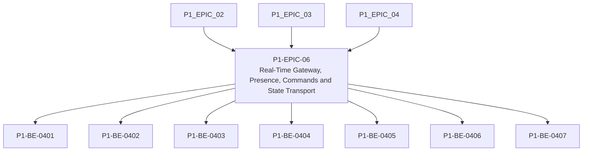

# P1-EPIC-06 — Real-Time Gateway, Presence, Commands and State Transport

**Roadmap:** [RM-P1-02](../RM-P1-02.md)

## Goal

Create the secure real-time cloud, device and browser path for presence, commands, state and health.

## Scope

This Epic groups closely related Phase 1 management tasks from the existing engineering backlog. It is a planning document only and does not introduce code changes or new architecture.

## Tasks

- [P1-BE-0401](../../tasks/PHASE_1_ENGINEERING_BACKLOG.md#p1-be-0401-implement-authenticated-device-websocket-handshake) — Implement authenticated device WebSocket handshake
- [P1-BE-0402](../../tasks/PHASE_1_ENGINEERING_BACKLOG.md#p1-be-0402-implement-heartbeat-and-presence-tracking) — Implement heartbeat and presence tracking
- [P1-BE-0403](../../tasks/PHASE_1_ENGINEERING_BACKLOG.md#p1-be-0403-implement-browser-room-websocket-session) — Implement browser room WebSocket session
- [P1-BE-0404](../../tasks/PHASE_1_ENGINEERING_BACKLOG.md#p1-be-0404-implement-command-creation-service) — Implement command creation service
- [P1-BE-0405](../../tasks/PHASE_1_ENGINEERING_BACKLOG.md#p1-be-0405-implement-command-delivery-acknowledgement-and-completion-tracking) — Implement command delivery, acknowledgement and completion tracking
- [P1-BE-0406](../../tasks/PHASE_1_ENGINEERING_BACKLOG.md#p1-be-0406-implement-reported-state-ingestion) — Implement reported state ingestion
- [P1-BE-0407](../../tasks/PHASE_1_ENGINEERING_BACKLOG.md#p1-be-0407-implement-health-event-ingestion) — Implement health event ingestion

## Dependencies

- [P1-EPIC-02](P1-EPIC-02.md)
- [P1-EPIC-03](P1-EPIC-03.md)
- [P1-EPIC-04](P1-EPIC-04.md)

## ADR cross-reference

- [ADR-001](../../decisions/ADR-001-can-a-node-move-between-networks-or-public-ip-addresses-without-re-pai.md)
- [ADR-002](../../decisions/ADR-002-how-is-communication-between-cloud-services-and-nodes-encrypted.md)
- [ADR-008](../../decisions/ADR-008-should-cloud-controls-address-physical-devices-directly.md)
- [ADR-012](../../decisions/ADR-012-should-long-term-settings-use-commands-or-desired-state.md)
- [ADR-013](../../decisions/ADR-013-command-priority.md)
- [ADR-014](../../decisions/ADR-014-room-control-sessions.md)
- [ADR-015](../../decisions/ADR-015-hardware-abstraction.md)
- [ADR-017](../../decisions/ADR-017-preset-execution.md)
- [ADR-019](../../decisions/ADR-019-time-standard.md)
- [ADR-021](../../decisions/ADR-021-monitoring.md)
- [ADR-022](../../decisions/ADR-022-telemetry-retention.md)
- [ADR-023](../../decisions/ADR-023-remote-support.md)
- [ADR-026](../../decisions/ADR-026-phase-1-mvp.md)
- [ADR-028](../../decisions/ADR-028-what-tenancy-model-should-be-used-initially-and-for-future-external-cu.md)

## Dependency diagram

## Review Gate checklist

- Task links point to the authoritative Phase 1 Engineering Backlog.
- Referenced ADRs have been reviewed for the task scope.
- Any proposed or in-review ADR dependency is handled by a Decision Request before implementation.
- Deliverables remain inside Phase 1 and do not create new architecture.
- Completion evidence covers behaviour, files, tests, migrations, contracts, documentation, limitations, rollback notes and ADRs.

## Completion record

Status: Complete pending Review Gate approval.

Completed tasks:

- P1-BE-0401 — Authenticated device WebSocket handshake implemented with secure transport enforcement, device credential validation, `device.hello` processing and `server.welcome` response.
- P1-BE-0402 — Heartbeat-backed temporary presence implemented with online/offline transitions and browser broadcasts.
- P1-BE-0403 — Browser room session implemented with authenticated room subscription, multiple viewers and one active controller with Technician/Admin takeover.
- P1-BE-0404 — Command creation service implemented with server-side role/company/room/session/capability/value/expiry/idempotency validation and audit evidence.
- P1-BE-0405 — Command delivery, acknowledgement and completion tracking implemented with per-device routing, expiry checks, duplicate idempotency protection, browser broadcasts and audit evidence.
- P1-BE-0406 — Reported state ingestion implemented with authenticated device matching and monotonic revision enforcement.
- P1-BE-0407 — Health event ingestion implemented with status, issue-code, severity and first-observed validation plus retention metadata.

Completion evidence:

- Tests: `npm run check`, `npm test`, `git diff --check`.
- Migrations: no migration added; P1-BE-0204 cloud command/state/event tables remain the durable schema baseline.
- Contracts: existing WebSocket message schemas and command API contract reused; no public contract version change required.
- Infrastructure: no infrastructure changes and no new inbound port; implementation remains framework-neutral gateway service logic.
- Known limitations: deployed WebSocket server/backplane, web application screens, endpoint command execution, adapter host, simulator and TouchDesigner behaviour remain out of scope for this Epic.
- Rollback: remove the gateway service, gateway tests and documentation status updates; no database or infrastructure rollback is required.
- Decision Requests: none created; confirmed ADR-014 resolved the room controller behaviour referenced by P1-BE-0403.
