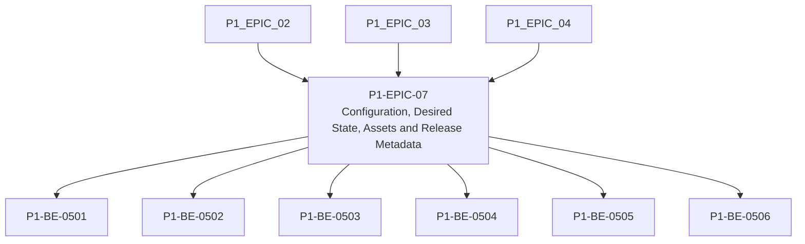

# P1-EPIC-07 — Configuration, Desired State, Assets and Release Metadata

**Roadmap:** [RM-P1-03](../RM-P1-03.md)

## Goal

Implement cloud-side configuration, desired state, asset metadata and release manifest flows.

## Scope

This Epic groups closely related Phase 1 management tasks from the existing engineering backlog. It is a planning document only and does not introduce code changes or new architecture.

## Tasks

- [P1-BE-0501](../../tasks/PHASE_1_ENGINEERING_BACKLOG.md#p1-be-0501-implement-configuration-draft-validation) — Implement configuration draft validation
- [P1-BE-0502](../../tasks/PHASE_1_ENGINEERING_BACKLOG.md#p1-be-0502-implement-configuration-publication) — Implement configuration publication
- [P1-BE-0503](../../tasks/PHASE_1_ENGINEERING_BACKLOG.md#p1-be-0503-implement-desired-configuration-endpoint) — Implement desired configuration endpoint
- [P1-BE-0504](../../tasks/PHASE_1_ENGINEERING_BACKLOG.md#p1-be-0504-implement-configuration-report-endpoint) — Implement configuration report endpoint
- [P1-BE-0505](../../tasks/PHASE_1_ENGINEERING_BACKLOG.md#p1-be-0505-implement-minimal-media-asset-metadata) — Implement minimal media asset metadata
- [P1-BE-0506](../../tasks/PHASE_1_ENGINEERING_BACKLOG.md#p1-be-0506-implement-release-manifest-api) — Implement release manifest API

## Dependencies

- [P1-EPIC-02](P1-EPIC-02.md)
- [P1-EPIC-03](P1-EPIC-03.md)
- [P1-EPIC-04](P1-EPIC-04.md)

## ADR cross-reference

- [ADR-001](../../decisions/ADR-001-can-a-node-move-between-networks-or-public-ip-addresses-without-re-pai.md)
- [ADR-003](../../decisions/ADR-003-what-is-the-source-of-truth-for-database-infrastructure-and-configurat.md)
- [ADR-008](../../decisions/ADR-008-should-cloud-controls-address-physical-devices-directly.md)
- [ADR-009](../../decisions/ADR-009-what-happens-if-local-settings-drift-from-the-published-cloud-configur.md)
- [ADR-010](../../decisions/ADR-010-how-are-agent-adapter-touchdesigner-and-schema-versions-kept-compatibl.md)
- [ADR-012](../../decisions/ADR-012-should-long-term-settings-use-commands-or-desired-state.md)
- [ADR-015](../../decisions/ADR-015-hardware-abstraction.md)
- [ADR-019](../../decisions/ADR-019-time-standard.md)
- [ADR-020](../../decisions/ADR-020-media-asset-management.md)
- [ADR-024](../../decisions/ADR-024-touchdesigner-licensing.md)
- [ADR-026](../../decisions/ADR-026-phase-1-mvp.md)
- [ADR-029](../../decisions/ADR-029-how-should-client-deployments-be-created.md)

## Dependency diagram

## Review Gate checklist

- Task links point to the authoritative Phase 1 Engineering Backlog.
- Referenced ADRs have been reviewed for the task scope.
- Any proposed or in-review ADR dependency is handled by a Decision Request before implementation.
- Deliverables remain inside Phase 1 and do not create new architecture.
- Completion evidence covers behaviour, files, tests, migrations, contracts, documentation, limitations, rollback notes and ADRs.
