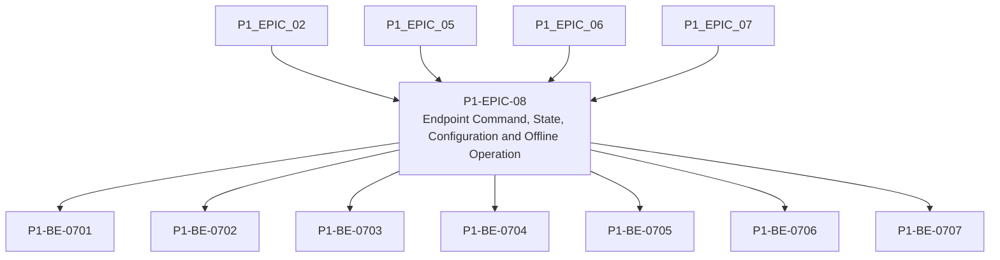

# P1-EPIC-08 — Endpoint Command, State, Configuration and Offline Operation

**Roadmap:** [RM-P1-03](../RM-P1-03.md)

## Goal

Implement endpoint execution, deduplication, local validation, known-good activation, state publishing, event buffering and offline controls.

## Scope

This Epic groups closely related Phase 1 management tasks from the existing engineering backlog. It is a planning document only and does not introduce code changes or new architecture.

## Tasks

- [P1-BE-0701](../../tasks/PHASE_1_ENGINEERING_BACKLOG.md#p1-be-0701-implement-command-dispatcher) — Implement command dispatcher
- [P1-BE-0702](../../tasks/PHASE_1_ENGINEERING_BACKLOG.md#p1-be-0702-implement-command-deduplication-store) — Implement command deduplication store
- [P1-BE-0703](../../tasks/PHASE_1_ENGINEERING_BACKLOG.md#p1-be-0703-implement-configuration-download-and-local-validation) — Implement configuration download and local validation
- [P1-BE-0704](../../tasks/PHASE_1_ENGINEERING_BACKLOG.md#p1-be-0704-implement-known-good-configuration-activation-and-rollback) — Implement known-good configuration activation and rollback
- [P1-BE-0705](../../tasks/PHASE_1_ENGINEERING_BACKLOG.md#p1-be-0705-implement-reported-state-publisher) — Implement reported state publisher
- [P1-BE-0706](../../tasks/PHASE_1_ENGINEERING_BACKLOG.md#p1-be-0706-implement-local-event-and-audit-queue) — Implement local event and audit queue
- [P1-BE-0707](../../tasks/PHASE_1_ENGINEERING_BACKLOG.md#p1-be-0707-implement-offline-local-usertechnician-control-boundary) — Implement offline local User/Technician control boundary

## Dependencies

- [P1-EPIC-02](P1-EPIC-02.md)
- [P1-EPIC-05](P1-EPIC-05.md)
- [P1-EPIC-06](P1-EPIC-06.md)
- [P1-EPIC-07](P1-EPIC-07.md)

## ADR cross-reference

- [ADR-001](../../decisions/ADR-001-can-a-node-move-between-networks-or-public-ip-addresses-without-re-pai.md)
- [ADR-004](../../decisions/ADR-004-must-a-node-remain-controllable-when-cloud-access-is-unavailable.md)
- [ADR-005](../../decisions/ADR-005-what-level-of-offline-control-is-permitted.md)
- [ADR-008](../../decisions/ADR-008-should-cloud-controls-address-physical-devices-directly.md)
- [ADR-009](../../decisions/ADR-009-what-happens-if-local-settings-drift-from-the-published-cloud-configur.md)
- [ADR-012](../../decisions/ADR-012-should-long-term-settings-use-commands-or-desired-state.md)
- [ADR-013](../../decisions/ADR-013-command-priority.md)
- [ADR-014](../../decisions/ADR-014-room-control-sessions.md)
- [ADR-015](../../decisions/ADR-015-hardware-abstraction.md)
- [ADR-018](../../decisions/ADR-018-offline-programming.md)
- [ADR-019](../../decisions/ADR-019-time-standard.md)
- [ADR-020](../../decisions/ADR-020-media-asset-management.md)
- [ADR-021](../../decisions/ADR-021-monitoring.md)
- [ADR-022](../../decisions/ADR-022-telemetry-retention.md)
- [ADR-026](../../decisions/ADR-026-phase-1-mvp.md)
- [ADR-027](../../decisions/ADR-027-should-the-system-add-fallback-paths-when-the-primary-implementation-f.md)

## Dependency diagram

## Review Gate checklist

- Task links point to the authoritative Phase 1 Engineering Backlog.
- Referenced ADRs have been reviewed for the task scope.
- Any proposed or in-review ADR dependency is handled by a Decision Request before implementation.
- Deliverables remain inside Phase 1 and do not create new architecture.
- Completion evidence covers behaviour, files, tests, migrations, contracts, documentation, limitations, rollback notes and ADRs.
