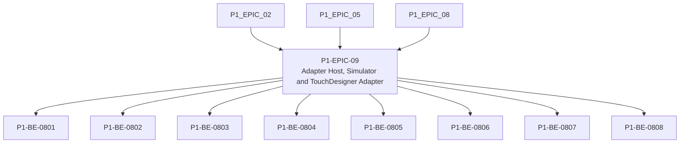

# P1-EPIC-09 — Adapter Host, Simulator and TouchDesigner Adapter

**Roadmap:** [RM-P1-03](../RM-P1-03.md)

## Goal

Implement the Phase 1 adapter host, System Health adapter, simulator and TouchDesigner adapter.

## Scope

This Epic groups closely related Phase 1 management tasks from the existing engineering backlog. It is a planning document only and does not introduce code changes or new architecture.

## Tasks

- [P1-BE-0801](../../tasks/PHASE_1_ENGINEERING_BACKLOG.md#p1-be-0801-define-internal-adapter-contract-in-code) — Define internal adapter contract in code
- [P1-BE-0802](../../tasks/PHASE_1_ENGINEERING_BACKLOG.md#p1-be-0802-implement-adapter-host-lifecycle) — Implement adapter host lifecycle
- [P1-BE-0803](../../tasks/PHASE_1_ENGINEERING_BACKLOG.md#p1-be-0803-implement-system-health-adapter) — Implement System Health adapter
- [P1-BE-0804](../../tasks/PHASE_1_ENGINEERING_BACKLOG.md#p1-be-0804-implement-simulated-node-adapter) — Implement simulated node adapter
- [P1-BE-0805](../../tasks/PHASE_1_ENGINEERING_BACKLOG.md#p1-be-0805-implement-touchdesigner-process-launch) — Implement TouchDesigner process launch
- [P1-BE-0806](../../tasks/PHASE_1_ENGINEERING_BACKLOG.md#p1-be-0806-implement-touchdesigner-localhost-websocket-bridge) — Implement TouchDesigner localhost WebSocket bridge
- [P1-BE-0807](../../tasks/PHASE_1_ENGINEERING_BACKLOG.md#p1-be-0807-implement-touchdesigner-command-handlers) — Implement TouchDesigner command handlers
- [P1-BE-0808](../../tasks/PHASE_1_ENGINEERING_BACKLOG.md#p1-be-0808-implement-touchdesigner-heartbeat-and-restart-policy) — Implement TouchDesigner heartbeat and restart policy

## Dependencies

- [P1-EPIC-02](P1-EPIC-02.md)
- [P1-EPIC-05](P1-EPIC-05.md)
- [P1-EPIC-08](P1-EPIC-08.md)

## ADR cross-reference

- [ADR-002](../../decisions/ADR-002-how-is-communication-between-cloud-services-and-nodes-encrypted.md)
- [ADR-008](../../decisions/ADR-008-should-cloud-controls-address-physical-devices-directly.md)
- [ADR-015](../../decisions/ADR-015-hardware-abstraction.md)
- [ADR-016](../../decisions/ADR-016-supported-adapters-in-phase-1.md)
- [ADR-017](../../decisions/ADR-017-preset-execution.md)
- [ADR-021](../../decisions/ADR-021-monitoring.md)
- [ADR-022](../../decisions/ADR-022-telemetry-retention.md)
- [ADR-024](../../decisions/ADR-024-touchdesigner-licensing.md)
- [ADR-025](../../decisions/ADR-025-simulator.md)
- [ADR-026](../../decisions/ADR-026-phase-1-mvp.md)
- [ADR-027](../../decisions/ADR-027-should-the-system-add-fallback-paths-when-the-primary-implementation-f.md)
- [ADR-032](../../decisions/ADR-032-can-the-node-support-engines-other-than-touchdesigner.md)

## Dependency diagram

## Review Gate checklist

- Task links point to the authoritative Phase 1 Engineering Backlog.
- Referenced ADRs have been reviewed for the task scope.
- Any proposed or in-review ADR dependency is handled by a Decision Request before implementation.
- Deliverables remain inside Phase 1 and do not create new architecture.
- Completion evidence covers behaviour, files, tests, migrations, contracts, documentation, limitations, rollback notes and ADRs.
