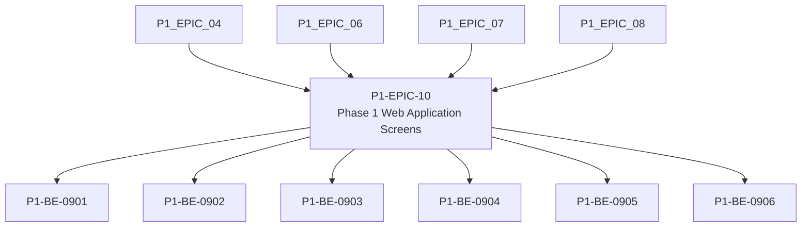

# P1-EPIC-10 — Phase 1 Web Application Screens

**Roadmap:** [RM-P1-04](../RM-P1-04.md)

## Goal

Build the minimum admin, technician, device detail, room control and event log screens.

## Scope

This Epic groups closely related Phase 1 management tasks from the existing engineering backlog. It is a planning document only and does not introduce code changes or new architecture.

## Tasks

- [P1-BE-0901](../../tasks/PHASE_1_ENGINEERING_BACKLOG.md#p1-be-0901-build-admin-unclaimed-device-queue) — Build admin unclaimed-device queue
- [P1-BE-0902](../../tasks/PHASE_1_ENGINEERING_BACKLOG.md#p1-be-0902-build-pairing-claim-flow) — Build pairing claim flow
- [P1-BE-0903](../../tasks/PHASE_1_ENGINEERING_BACKLOG.md#p1-be-0903-build-room-assignment-screen) — Build room assignment screen
- [P1-BE-0904](../../tasks/PHASE_1_ENGINEERING_BACKLOG.md#p1-be-0904-build-device-detail-and-diagnostics-screen) — Build device detail and diagnostics screen
- [P1-BE-0905](../../tasks/PHASE_1_ENGINEERING_BACKLOG.md#p1-be-0905-build-basic-room-control-page) — Build basic room control page
- [P1-BE-0906](../../tasks/PHASE_1_ENGINEERING_BACKLOG.md#p1-be-0906-build-event-log-view) — Build event log view

## Dependencies

- [P1-EPIC-04](P1-EPIC-04.md)
- [P1-EPIC-06](P1-EPIC-06.md)
- [P1-EPIC-07](P1-EPIC-07.md)
- [P1-EPIC-08](P1-EPIC-08.md)

## ADR cross-reference

- [ADR-002](../../decisions/ADR-002-how-is-communication-between-cloud-services-and-nodes-encrypted.md)
- [ADR-008](../../decisions/ADR-008-should-cloud-controls-address-physical-devices-directly.md)
- [ADR-011](../../decisions/ADR-011-what-is-the-default-device-lifecycle.md)
- [ADR-012](../../decisions/ADR-012-should-long-term-settings-use-commands-or-desired-state.md)
- [ADR-013](../../decisions/ADR-013-command-priority.md)
- [ADR-014](../../decisions/ADR-014-room-control-sessions.md)
- [ADR-019](../../decisions/ADR-019-time-standard.md)
- [ADR-021](../../decisions/ADR-021-monitoring.md)
- [ADR-022](../../decisions/ADR-022-telemetry-retention.md)
- [ADR-023](../../decisions/ADR-023-remote-support.md)
- [ADR-026](../../decisions/ADR-026-phase-1-mvp.md)
- [ADR-028](../../decisions/ADR-028-what-tenancy-model-should-be-used-initially-and-for-future-external-cu.md)

## Dependency diagram

## Review Gate checklist

- Task links point to the authoritative Phase 1 Engineering Backlog.
- Referenced ADRs have been reviewed for the task scope.
- Any proposed or in-review ADR dependency is handled by a Decision Request before implementation.
- Deliverables remain inside Phase 1 and do not create new architecture.
- Completion evidence covers behaviour, files, tests, migrations, contracts, documentation, limitations, rollback notes and ADRs.
