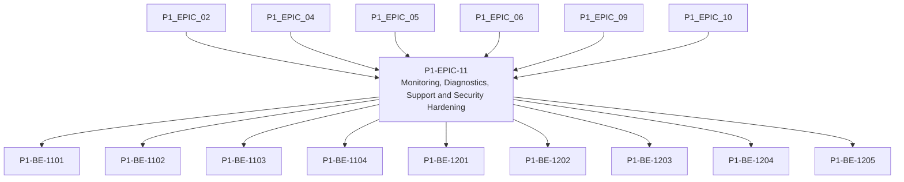

# P1-EPIC-11 — Monitoring, Diagnostics, Support and Security Hardening

**Roadmap:** [RM-P1-04](../RM-P1-04.md)

## Goal

Make failures visible, diagnostic evidence useful and Phase 1 security boundaries testable.

## Scope

This Epic groups closely related Phase 1 management tasks from the existing engineering backlog. It is a planning document only and does not introduce code changes or new architecture.

## Tasks

- [P1-BE-1101](../../tasks/PHASE_1_ENGINEERING_BACKLOG.md#p1-be-1101-implement-structured-logging-standard-in-cloud-services) — Implement structured logging standard in cloud services
- [P1-BE-1102](../../tasks/PHASE_1_ENGINEERING_BACKLOG.md#p1-be-1102-implement-structured-logging-standard-in-endpoint-agent) — Implement structured logging standard in endpoint agent
- [P1-BE-1103](../../tasks/PHASE_1_ENGINEERING_BACKLOG.md#p1-be-1103-implement-diagnostic-bundle-export) — Implement diagnostic bundle export
- [P1-BE-1104](../../tasks/PHASE_1_ENGINEERING_BACKLOG.md#p1-be-1104-implement-offline-and-disk-space-alerts) — Implement offline and disk-space alerts
- [P1-BE-1201](../../tasks/PHASE_1_ENGINEERING_BACKLOG.md#p1-be-1201-implement-userdevice-authentication-separation-tests) — Implement user/device authentication separation tests
- [P1-BE-1202](../../tasks/PHASE_1_ENGINEERING_BACKLOG.md#p1-be-1202-implement-tenant-and-ownership-authorisation-tests) — Implement tenant and ownership authorisation tests
- [P1-BE-1203](../../tasks/PHASE_1_ENGINEERING_BACKLOG.md#p1-be-1203-implement-command-allow-list-security-tests) — Implement command allow-list security tests
- [P1-BE-1204](../../tasks/PHASE_1_ENGINEERING_BACKLOG.md#p1-be-1204-implement-local-api-exposure-tests) — Implement local API exposure tests
- [P1-BE-1205](../../tasks/PHASE_1_ENGINEERING_BACKLOG.md#p1-be-1205-implement-certificate-revocation-and-rotation-tests) — Implement certificate revocation and rotation tests

## Dependencies

- [P1-EPIC-02](P1-EPIC-02.md)
- [P1-EPIC-04](P1-EPIC-04.md)
- [P1-EPIC-05](P1-EPIC-05.md)
- [P1-EPIC-06](P1-EPIC-06.md)
- [P1-EPIC-09](P1-EPIC-09.md)
- [P1-EPIC-10](P1-EPIC-10.md)

## ADR cross-reference

- [ADR-001](../../decisions/ADR-001-can-a-node-move-between-networks-or-public-ip-addresses-without-re-pai.md)
- [ADR-002](../../decisions/ADR-002-how-is-communication-between-cloud-services-and-nodes-encrypted.md)
- [ADR-004](../../decisions/ADR-004-must-a-node-remain-controllable-when-cloud-access-is-unavailable.md)
- [ADR-005](../../decisions/ADR-005-what-level-of-offline-control-is-permitted.md)
- [ADR-008](../../decisions/ADR-008-should-cloud-controls-address-physical-devices-directly.md)
- [ADR-011](../../decisions/ADR-011-what-is-the-default-device-lifecycle.md)
- [ADR-015](../../decisions/ADR-015-hardware-abstraction.md)
- [ADR-019](../../decisions/ADR-019-time-standard.md)
- [ADR-021](../../decisions/ADR-021-monitoring.md)
- [ADR-022](../../decisions/ADR-022-telemetry-retention.md)
- [ADR-023](../../decisions/ADR-023-remote-support.md)
- [ADR-026](../../decisions/ADR-026-phase-1-mvp.md)
- [ADR-028](../../decisions/ADR-028-what-tenancy-model-should-be-used-initially-and-for-future-external-cu.md)

## Dependency diagram

## Review Gate checklist

- Task links point to the authoritative Phase 1 Engineering Backlog.
- Referenced ADRs have been reviewed for the task scope.
- Any proposed or in-review ADR dependency is handled by a Decision Request before implementation.
- Deliverables remain inside Phase 1 and do not create new architecture.
- Completion evidence covers behaviour, files, tests, migrations, contracts, documentation, limitations, rollback notes and ADRs.
