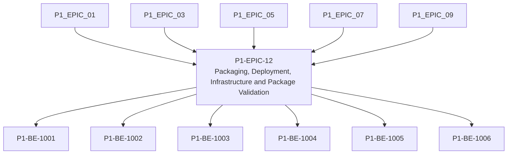

# P1-EPIC-12 — Packaging, Deployment, Infrastructure and Package Validation

**Roadmap:** [RM-P1-05](../RM-P1-05.md)

## Goal

Create code-owned deployment, installer, package validation and rollback documentation.

## Scope

This Epic groups closely related Phase 1 management tasks from the existing engineering backlog. It is a planning document only and does not introduce code changes or new architecture.

## Tasks

- [P1-BE-1001](../../tasks/PHASE_1_ENGINEERING_BACKLOG.md#p1-be-1001-add-phase-1-cloud-infrastructure-module-skeleton) — Add Phase 1 cloud infrastructure module skeleton
- [P1-BE-1002](../../tasks/PHASE_1_ENGINEERING_BACKLOG.md#p1-be-1002-add-environment-configuration-contract) — Add environment configuration contract
- [P1-BE-1003](../../tasks/PHASE_1_ENGINEERING_BACKLOG.md#p1-be-1003-build-endpoint-installer-package) — Build endpoint installer package
- [P1-BE-1004](../../tasks/PHASE_1_ENGINEERING_BACKLOG.md#p1-be-1004-build-touchdesigner-project-package-manifest) — Build TouchDesigner project package manifest
- [P1-BE-1005](../../tasks/PHASE_1_ENGINEERING_BACKLOG.md#p1-be-1005-implement-package-validation-on-endpoint) — Implement package validation on endpoint
- [P1-BE-1006](../../tasks/PHASE_1_ENGINEERING_BACKLOG.md#p1-be-1006-add-release-and-rollback-documentation) — Add release and rollback documentation

## Dependencies

- [P1-EPIC-01](P1-EPIC-01.md)
- [P1-EPIC-03](P1-EPIC-03.md)
- [P1-EPIC-05](P1-EPIC-05.md)
- [P1-EPIC-07](P1-EPIC-07.md)
- [P1-EPIC-09](P1-EPIC-09.md)

## ADR cross-reference

- [ADR-002](../../decisions/ADR-002-how-is-communication-between-cloud-services-and-nodes-encrypted.md)
- [ADR-003](../../decisions/ADR-003-what-is-the-source-of-truth-for-database-infrastructure-and-configurat.md)
- [ADR-010](../../decisions/ADR-010-how-are-agent-adapter-touchdesigner-and-schema-versions-kept-compatibl.md)
- [ADR-020](../../decisions/ADR-020-media-asset-management.md)
- [ADR-024](../../decisions/ADR-024-touchdesigner-licensing.md)
- [ADR-026](../../decisions/ADR-026-phase-1-mvp.md)
- [ADR-027](../../decisions/ADR-027-should-the-system-add-fallback-paths-when-the-primary-implementation-f.md)
- [ADR-028](../../decisions/ADR-028-what-tenancy-model-should-be-used-initially-and-for-future-external-cu.md)
- [ADR-029](../../decisions/ADR-029-how-should-client-deployments-be-created.md)

## Dependency diagram

## Review Gate checklist

- Task links point to the authoritative Phase 1 Engineering Backlog.
- Referenced ADRs have been reviewed for the task scope.
- Any proposed or in-review ADR dependency is handled by a Decision Request before implementation.
- Deliverables remain inside Phase 1 and do not create new architecture.
- Completion evidence covers behaviour, files, tests, migrations, contracts, documentation, limitations, rollback notes and ADRs.
