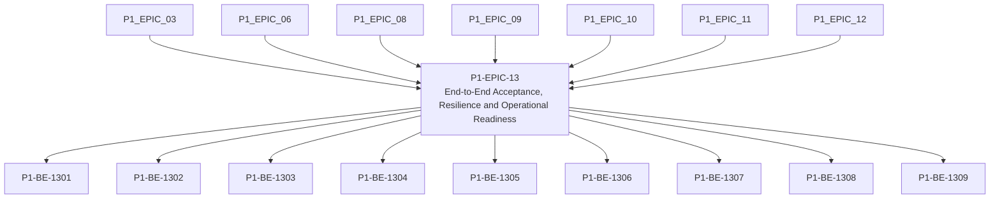

# P1-EPIC-13 — End-to-End Acceptance, Resilience and Operational Readiness

**Roadmap:** [RM-P1-05](../RM-P1-05.md)

## Goal

Prove the complete Phase 1 platform through clean rebuild, simulator, Windows endpoint, TouchDesigner, resilience and demonstration tests.

## Scope

This Epic groups closely related Phase 1 management tasks from the existing engineering backlog. It is a planning document only and does not introduce code changes or new architecture.

## Tasks

- [P1-BE-1301](../../tasks/PHASE_1_ENGINEERING_BACKLOG.md#p1-be-1301-create-clean-environment-rebuild-test) — Create clean-environment rebuild test
- [P1-BE-1302](../../tasks/PHASE_1_ENGINEERING_BACKLOG.md#p1-be-1302-create-simulator-end-to-end-lifecycle-test) — Create simulator end-to-end lifecycle test
- [P1-BE-1303](../../tasks/PHASE_1_ENGINEERING_BACKLOG.md#p1-be-1303-create-windows-endpoint-installation-acceptance-test) — Create Windows endpoint installation acceptance test
- [P1-BE-1304](../../tasks/PHASE_1_ENGINEERING_BACKLOG.md#p1-be-1304-create-touchdesigner-hardware-path-abstraction-test) — Create TouchDesigner hardware-path abstraction test
- [P1-BE-1305](../../tasks/PHASE_1_ENGINEERING_BACKLOG.md#p1-be-1305-create-network-loss-and-roaming-resilience-test) — Create network loss and roaming resilience test
- [P1-BE-1306](../../tasks/PHASE_1_ENGINEERING_BACKLOG.md#p1-be-1306-create-reboot-while-offline-recovery-test) — Create reboot while offline recovery test
- [P1-BE-1307](../../tasks/PHASE_1_ENGINEERING_BACKLOG.md#p1-be-1307-create-configuration-failure-rollback-test) — Create configuration failure rollback test
- [P1-BE-1308](../../tasks/PHASE_1_ENGINEERING_BACKLOG.md#p1-be-1308-create-update-package-validation-and-rollback-test) — Create update package validation and rollback test
- [P1-BE-1309](../../tasks/PHASE_1_ENGINEERING_BACKLOG.md#p1-be-1309-create-phase-1-demonstration-script) — Create Phase 1 demonstration script

## Dependencies

- [P1-EPIC-03](P1-EPIC-03.md)
- [P1-EPIC-06](P1-EPIC-06.md)
- [P1-EPIC-08](P1-EPIC-08.md)
- [P1-EPIC-09](P1-EPIC-09.md)
- [P1-EPIC-10](P1-EPIC-10.md)
- [P1-EPIC-11](P1-EPIC-11.md)
- [P1-EPIC-12](P1-EPIC-12.md)

## ADR cross-reference

- [ADR-001](../../decisions/ADR-001-can-a-node-move-between-networks-or-public-ip-addresses-without-re-pai.md)
- [ADR-002](../../decisions/ADR-002-how-is-communication-between-cloud-services-and-nodes-encrypted.md)
- [ADR-003](../../decisions/ADR-003-what-is-the-source-of-truth-for-database-infrastructure-and-configurat.md)
- [ADR-004](../../decisions/ADR-004-must-a-node-remain-controllable-when-cloud-access-is-unavailable.md)
- [ADR-008](../../decisions/ADR-008-should-cloud-controls-address-physical-devices-directly.md)
- [ADR-009](../../decisions/ADR-009-what-happens-if-local-settings-drift-from-the-published-cloud-configur.md)
- [ADR-010](../../decisions/ADR-010-how-are-agent-adapter-touchdesigner-and-schema-versions-kept-compatibl.md)
- [ADR-011](../../decisions/ADR-011-what-is-the-default-device-lifecycle.md)
- [ADR-012](../../decisions/ADR-012-should-long-term-settings-use-commands-or-desired-state.md)
- [ADR-015](../../decisions/ADR-015-hardware-abstraction.md)
- [ADR-016](../../decisions/ADR-016-supported-adapters-in-phase-1.md)
- [ADR-024](../../decisions/ADR-024-touchdesigner-licensing.md)
- [ADR-025](../../decisions/ADR-025-simulator.md)
- [ADR-026](../../decisions/ADR-026-phase-1-mvp.md)
- [ADR-027](../../decisions/ADR-027-should-the-system-add-fallback-paths-when-the-primary-implementation-f.md)
- [ADR-028](../../decisions/ADR-028-what-tenancy-model-should-be-used-initially-and-for-future-external-cu.md)
- [ADR-029](../../decisions/ADR-029-how-should-client-deployments-be-created.md)
- [ADR-032](../../decisions/ADR-032-can-the-node-support-engines-other-than-touchdesigner.md)

## Dependency diagram

## Review Gate checklist

- Task links point to the authoritative Phase 1 Engineering Backlog.
- Referenced ADRs have been reviewed for the task scope.
- Any proposed or in-review ADR dependency is handled by a Decision Request before implementation.
- Deliverables remain inside Phase 1 and do not create new architecture.
- Completion evidence covers behaviour, files, tests, migrations, contracts, documentation, limitations, rollback notes and ADRs.

## Completion record

Status: Complete pending Review Gate approval.

Completed tasks:

- P1-BE-1301 — Create clean-environment rebuild test.
- P1-BE-1302 — Create simulator end-to-end lifecycle test.
- P1-BE-1303 — Create Windows endpoint installation acceptance test.
- P1-BE-1304 — Create TouchDesigner hardware-path abstraction test.
- P1-BE-1305 — Create network loss and roaming resilience test.
- P1-BE-1306 — Create reboot while offline recovery test.
- P1-BE-1307 — Create configuration failure rollback test.
- P1-BE-1308 — Create update package validation and rollback test.
- P1-BE-1309 — Create Phase 1 demonstration script.

Changed behaviour: the repository now includes aggregate end-to-end acceptance and resilience tests plus the Phase 1 demonstration script.

Tests and checks: `npm test` passed. `git diff --check` passed.

Migrations: none; no database schema change was required.

Contracts: none; existing contracts were reused without public API or WebSocket changes.

Review Gate: reached; do not begin any following Epic or future-phase work until P1-EPIC-13 Review Gate approval is complete.
