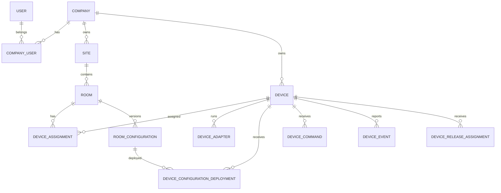

# Suggested Data Model

## Core entities



## Device

Suggested fields:

```text
device_id
company_id
display_name
ownership_status
lifecycle_status
hardware_model
hardware_serial
system_uuid
fingerprint
agent_version
protocol_version
last_seen_at
claimed_at
claimed_by_user_id
created_at
updated_at
```

## Device credential

```text
device_credential_id
device_id
certificate_thumbprint
issued_at
expires_at
revoked_at
revocation_reason
status
```

Private keys are not stored in the cloud database.

## Device registration

```text
registration_id
device_id
registration_status
first_seen_at
last_seen_at
source_ip
reported_hostname
reported_model
short_fingerprint
bootstrap_version
```

## Pairing session

```text
pairing_session_id
device_id
code_hash
token_id
created_at
expires_at
claimed_at
claimed_by_user_id
attempt_count
status
```

Store a hash of the code where practical, not the raw code.

## Site

```text
site_id
company_id
name
address_summary
timezone
status
```

## Room

```text
room_id
site_id
name
room_code_name
status
active_configuration_id
default_device_id
```

## Device assignment

```text
device_assignment_id
device_id
room_id
assigned_at
unassigned_at
assignment_role
status
```

A room and device remain separate entities.

## Device adapter

```text
device_adapter_id
device_id
adapter_type
adapter_version
manifest_json
status
installed_at
last_health_at
```

## Configuration

```text
configuration_id
room_id
revision
schema_version
status
configuration_json
created_by_user_id
created_at
published_by_user_id
published_at
```

Statuses:

```text
draft
validated
published
superseded
rolled_back
archived
```

## Configuration deployment

```text
deployment_id
configuration_id
device_id
desired_at
downloaded_at
activated_at
reported_revision
status
failure_code
failure_message
```

## Preset

```text
preset_id
room_id
name
description
revision
preset_json
user_visible
technician_visible
status
```

## Device command

```text
command_id
device_id
room_id
session_id
actor_user_id
action
parameters_json
required_capability
idempotency_key
issued_at
expires_at
acknowledged_at
completed_at
status
result_json
```

## Desired state

```text
device_id
revision
desired_state_json
updated_at
```

## Reported state

```text
device_id
revision
reported_state_json
reported_at
```

For high-frequency state, keep the latest snapshot in a fast store and periodically persist selected history.

## Device event

```text
device_event_id
device_id
event_type
severity
occurred_at
received_at
correlation_id
payload_json
```

## Release

```text
release_id
component_type
component_name
version
channel
manifest_json
package_uri
package_hash
signature
status
created_at
published_at
```

Component types:

```text
agent
adapter
touchdesigner_project
media_bundle
support_tool
```

## Audit event

```text
audit_event_id
company_id
actor_type
actor_id
action
target_type
target_id
occurred_at
source_ip
correlation_id
metadata_json
```

## Webhook subscription

```text
webhook_subscription_id
company_id
name
target_url
secret_reference
event_types_json
status
created_at
```

## Important constraints

- Device IDs are immutable.
- Room IDs are immutable.
- Pairing codes are unique only while active.
- Configuration revisions increase within a room.
- Reported-state revisions increase per device.
- Command idempotency keys are unique within an appropriate scope.
- A device can have only one active ownership record.
- A device should have only one active primary room assignment unless multi-room behaviour is explicitly supported.

## Phase 1 migration baseline

The Epic 3 migration baseline is implemented in `cloud/database/migrations` and is intentionally additive.

- `0001_migration_framework.sql` creates `schema_migrations` and `seed_runs` for migration and seed tracking.
- `0002_identity_company_site_room.sql` creates app user, company, company user, site and room foundation tables.
- `0003_device_lifecycle.sql` creates device lifecycle, credential, registration, pairing, adapter and room assignment tables. Pairing sessions store `code_hash`; raw pairing codes are not persisted.
- `0004_configuration_command_state_event.sql` creates room configuration, configuration deployment, preset, desired state, command, reported state, device event and audit event tables.
- `0005_release_package_metadata.sql` creates release, package and room release assignment metadata including version, channel, compatibility and package-integrity fields.

The initial Phase 1 seed data lives in `cloud/database/seeds/001_blue_elephant_phase1.sql` and is idempotent through `ON CONFLICT` statements.
